# Scenario’s

Dit hoofdstuk bevat een verzameling voorbeeldscenario’s die laten zien hoe het **Conceptueel Informatiemodel RTTP (CIM RTTP)** in de praktijk kan worden toegepast. De scenario’s illustreren hoe operationele situaties kunnen worden beschreven met behulp van de concepten uit het informatiemodel, zoals treinbewegingen, gebeurtenissen, activiteiten, materieelopstellingen, materieelsamenstellingen en materieeluitwisselingen.

De scenario’s hebben een illustratief karakter en zijn bedoeld om de toepassing van het model inzichtelijk te maken. Per scenario wordt daarom uitsluitend die informatie weergegeven die relevant is om de betreffende situatie en de bijbehorende modelleerkeuze te verduidelijken. Niet alle objecttypen, attributen en relaties uit het CIM RTTP worden in ieder scenario opgenomen. De gegevensuitwerkingen bevatten alleen de tabellen en gegevens die noodzakelijk zijn om het onderscheid met andere scenario’s zichtbaar te maken.

**Tijdstippen**

In de scenario’s worden bij gebeurtenissen verschillende soorten tijdstippen weergegeven. Deze worden aangeduid met een combinatie van twee letters:

Eerste letter (soort tijdstip)

- P = Publieke tijd

- V = Vroegste tijd

- U = Uiterste tijd

- W = Werkelijke tijd

Tweede letter (type gebeurtenis)

- V = Vertrektijd

- A = Aankomsttijd

- D = Doorkomsttijd

Voorbeelden:

- PV = Publieke Vertrektijd

- VA = Vroegste Aankomsttijd

- UD = Uiterste Doorkomsttijd

- WV = Werkelijke Vertrektijd

Werkelijke tijdstippen worden beschouwd als uitvoeringsinformatie. De overige tijdstippen worden gebruikt voor planning en bijsturing.

**Afgeleide activiteitstijden**

Bij activiteiten kan een tijdsinterval worden voorafgegaan door een **“/”**. Dit betekent dat het betreffende tijdstip afleidbaar is uit de begrenzende gebeurtenissen.

Voorbeeld: /8:50 – 9:30

In dit geval wordt de begintijd van de activiteit afgeleid van de gebeurtenis die de activiteit laat beginnen. Op vergelijkbare wijze kan een ontbrekende eindtijd worden afgeleid uit de gebeurtenis die de activiteit beëindigt.

Hiermee blijft zichtbaar dat gebeurtenissen de grenzen van activiteiten vormen, terwijl activiteiten zelf de tijdsintervallen tussen deze gebeurtenissen representeren.

## Eenvoudige treinbeweging met vertrek, doorkomst en aankomst

Dit scenario beschrijft een eenvoudige treinrit met een **vertrek**, een **doorkomst** en een **aankomst**. Het gaat alleen om de rit zelf; alles wat daarvoor gebeurt, zoals het klaarmaken of samenstellen van de trein, hoort hier niet bij.

De trein vertrekt vanaf **Dienstregelpunt A**, rijdt langs **Dienstregelpunt B** en komt aan op **Dienstregelpunt C**. Deze momenten geven aan waar de trein zich op dat moment bevindt.

Bij het vertrek en de aankomst worden verschillende soorten tijdstippen vastgelegd.

Voor reizigerstreinen wordt een **publieke tijd** vastgelegd: de tijd die zichtbaar is in de dienstregeling. Voor goederenvervoer is deze publieke tijd meestal niet aanwezig.

Daarnaast wordt een **geplande tijd** vastgelegd, die gebruikt wordt door infrabeheerders (IM) en vervoerders (RU) voor planning en bijsturing. Op deze geplande tijd kunnen marges worden vastgelegd in de vorm vanvroegste en laatste tijden voor vertrek, doorkomst en aankomst.

Omdat dit scenario nog niet is uitgevoerd, zijn de werkelijke tijden nog niet bekend en daarom leeg gelaten.

Tijdens de treinrit vindt de activiteit **‘reizigers vervoeren’** plaats. Deze activiteit begint bij de vertrekgebeurtenis en eindigt bij de aankomstgebeurtenis. Tussenliggende doorkomstgebeurtenissen dienen uitsluitend als meet- of stuurmoment en hebben geen invloed op de begrenzing van de activiteit.

Bij de aankomst zijn in dit scenario twee activiteiten vastgelegd. De activiteit ‘reizigers vervoeren’ representeert het vervoer tijdens de rit en onderscheidt zich daarmee van activiteiten zoals ‘commerciële stop’ en ‘machinist wisselen’, die plaatsvinden tijdens stilstand tussen aankomst- en vertrekgebeurtenissen.

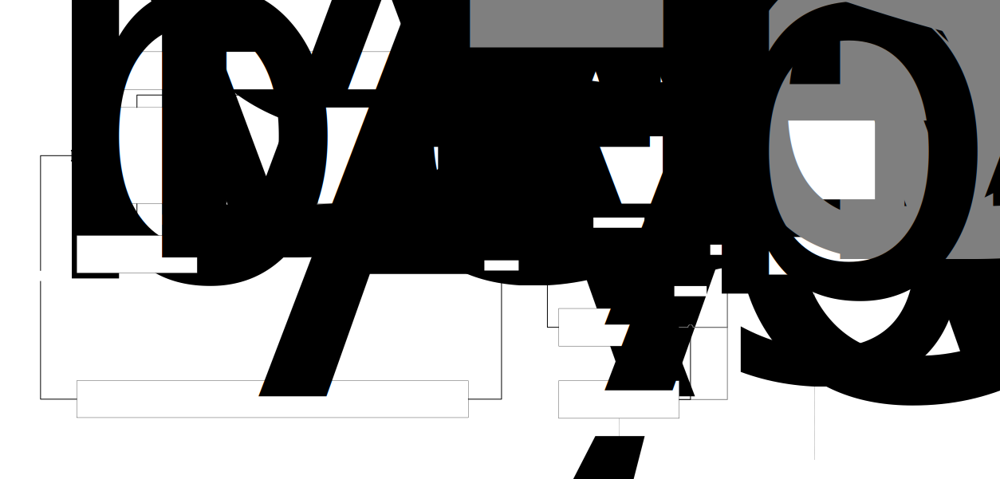

*Informatiekundig*

Dit scenario beschrijft een **treinbeweging van het type ‘vervoerbeweging’** met drie gebeurtenissen: **vertrek**, **doorkomst** en **aankomst**. Voorafgaande handelingen en configuraties, zoals materieelopstelling, -uitwisseling en samenstelling, maken geen deel uit van dit scenario.

De treinbeweging loopt van **Dienstregelpunt A** via **Dienstregelpunt B** naar **Dienstregelpunt C**. De gebeurtenissen zijn in de gegevensstructuur gerelateerd aan **operationele punten** (waaronder dienstregelpunten) waar de gebeurtenissen plaatsvinden.

Voor de gebeurtenissen vertrek en aankomst wordt de **publieke vertrek- en aankomsttijd** vastgelegd. Daarnaast worden voor vertrek, doorkomst en aankomst de **vroegste en uiterste tijdstippen** opgenomen ten behoeve van planning en bijsturing. De **werkelijke tijden** kunnen na uitvoering worden vastgelegd; in dit scenario zijn deze waarden nog niet bekend en daarom gevuld met «waardeOnbekend».

De activiteit **‘reizigers vervoeren’** heeft als begin de Gebeurtenis van het type ‘vertrek’ en eindigt bij de Gebeurtenis van het type aankomst. Bij de gebeurtenis **‘aankomst’** zijn twee activiteiten opgenomen.

*Gegevensuitwerking van het scenario*

Treinbeweging

| identificatie | treinnummer | typeBeweging    |      datum | bestaatUitGebeurtenis |
|---------------|-------------|-----------------|-----------:|-----------------------|
| T1            | OTN001      | vervoerbeweging | 01-04-2026 | G1, G2, G3, G4        |

Gebeurtenis

| identificatie | type      | begintijd                        | vindtPlaatsOp |
|---------------|-----------|----------------------------------|---------------|
| G1            | vertrek   | PV 8:15am; VV 8:15am; UV: 8:17am | OP1           |
| G2            | doorkomst | VD 8:28am; UD 8:32am             | OP2           |
| G3            | aankomst  | PA 8:45am; VA 8:44am; UA: 8:47am | OP3           |
| G4            | vertrek   | PA 8:50am; VA 8:50am; UA: 8:52am | OP3           |

Activiteit

| identificatie | soort | begintijd-eindtijd | beginGebeurtenis | eindGebeurtenis |
|----|----|----|----|----|
| A1 | reizigers vervoeren | */8:15-8:47am* | *G1* | *G3* |
| A3 | commercieel stoppen | 8:45-8:50am | G3 | G4 |
| A4 | machinist wisselen | 8:45-8:48am | G3 | G4 |

Operationeel punt

| identificatie | naam              | type            |
|---------------|-------------------|-----------------|
| OP1           | Dienstregelpunt A | Dienstregelpunt |
| OP2           | Dienstregelpunt B | Dienstregelpunt |
| OP3           | Dienstregelpunt C | Dienstregelpunt |

## Eenvoudige treinbeweging met materieelopstellingen

Dit scenario bouwt voort op het eerdere scenario met een eenvoudige treinrit. Daarnaast laat het ook zien hoe het **materieel vóór en na de rit opgesteld staat**, en hoe de **samenstelling van het materieel** daarbij hoort.

In dit scenario wordt het materieel **niet gesplitst of gecombineerd**. De samenstelling van de trein blijft dus tijdens het hele scenario hetzelfde. De treinsamenstelling die wordt gebruikt tijdens de treinrit is af te leiden uit **materieelsamenstelling 1**, die hoort bij **materieelopstelling 1**.

De materieelopstelling vóór de treinrit eindigt op het moment dat de trein vertrekt. Vanaf dat moment start de treinbeweging en is de spoorbezetting door de materieelopstelling beëindigd. Andersom geldt dat bij aankomst de treinbeweging stopt en overgaat in een nieuwe materieelopstelling. De treinbeweging is daarmee de aanvoerende beweging voor de materieelopstelling na aankomst.

Omdat er geen splitsingen of combinaties plaatsvinden, hebben **materieelopstelling 1 en materieelopstelling 2 dezelfde treinsamenstelling**.

Elke materieelopstelling heeft een treinbeweging die het materieel aanvoert en een treinbeweging die het materieel afvoert. De materieelopstelling begint zodra de aanvoerende treinbeweging is aangekomen, en eindigt zodra de afvoerende treinbeweging vertrekt. Pas op dat moment is de spoorbezetting van die materieelopstelling afgelopen.

In dit scenario zou het kunnen zijn dat de trein na aankomst mogelijk overgaat in een rangeerbeweging om materieel af te rangeren. Daarom is bij de aankomst een tweede activiteit **‘alleen uitstappen’** toegevoegd.

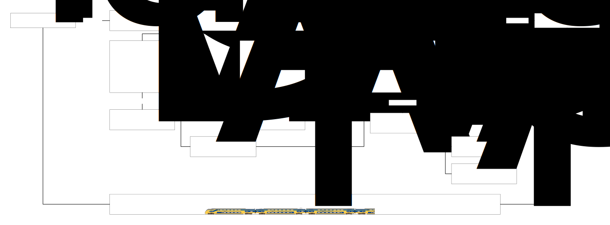

*Informatiekundig*

Dit scenario beschrijft de eerder gemodelleerde **eenvoudige treinbeweging**, uitgebreid met een **materieelopstelling vooraf**, een **materieelopstelling achteraf** en de bijbehorende **materieelsamenstellingen**.

In dit scenario vinden **geen splitsingen of combinaties** plaats. De treinsamenstelling van de treinbeweging kan worden afgeleid uit **materieelsamenstelling 1**, die is gerelateerd aan **materieelopstelling 1**.

Materieelopstelling 1 gaat over in een **afvoerende treinbeweging**. Op dat moment eindigt het gebruik van infrastructuurcapaciteit door de materieelopstelling en start het gebruik van infrastructuurcapaciteit door de treinbeweging. Bij aankomst gaat de treinbeweging over in een (nieuwe) **materieelopstelling**, waarbij de treinbeweging fungeert als **aanvoerende treinbeweging** van deze materieelopstelling.

Omdat er geen splitsingen of combinaties plaatsvinden, is de treinsamenstelling identiek voor **materieelopstelling 1 en materieelopstelling 2**.

Elke materieelopstelling heeft zowel een **aanvoerende** als een **afvoerende treinbeweging**. De begintijd van de materieelopstelling kan worden afgeleid van de **laatste gebeurtenis** (aankomst) van de aanvoerende treinbeweging. De materieelopstelling eindigt bij de **eerste gebeurtenis** (vertrek) van de afvoerende treinbeweging. Op dat moment eindigt ook de spoorbezetting van de materieelopstelling.

Als voorbeeld is in dit scenario zou het kunnen dat de trein na aankomst mogelijk overgaat in een rangeerbeweging voor het afrangeren van materieel. Om deze overgang te ondersteunen, is bij de gebeurtenis **aankomst** een tweede activiteit **‘alleen uitstappen’** opgenomen.

*Gegevensuitwerking van het scenario*

Treinbeweging

| identificatie | treinnummer | typeBeweging    |      datum | bestaatUitGebeurtenis |
|---------------|-------------|-----------------|-----------:|-----------------------|
| T1            | OTN001      | vervoerbeweging | 01-04-2026 | G1, G2, G3            |

Materieelopstelling

<table>
<colgroup>
<col style="width: 15%" />
<col style="width: 17%" />
<col style="width: 17%" />
<col style="width: 18%" />
<col style="width: 29%" />
</colgroup>
<thead>
<tr>
<th>identificatie</th>
<th>datum</th>
<th>
aanvoerende

Treinbeweging
</th>
<th>
afvoerende

Treinbeweging
</th>
<th>
steltop

Materieelsamenstelling
</th>
</tr>
</thead>
<tbody>
<tr>
<td>MO1</td>
<td>01-04-2026</td>
<td><em>«waardeOnbekend»</em></td>
<td>T1</td>
<td>MS1</td>
</tr>
<tr>
<td>MO2</td>
<td>01-04-2026</td>
<td>T1</td>
<td><em>«waardeOnbekend»</em></td>
<td>MS1</td>
</tr>
</tbody>
</table>

Materieelsamenstelling

| identificatie | materieel | treinstel |
|---------------|-----------|----------:|
| MS1           | VIRM4     |      9565 |

## Rangeerbeweging met materieelopstelling

Dit scenario beschrijft een **rangeerbeweging** in combinatie met materieelopstellingen. De rangeerbeweging is een speciale treinbeweging die start met een **vertrek** vanuit een **opstelgebied of opstelspoor A**.

Het vertrek van een rangeerbeweging heeft **geen publieke vertrektijd**, omdat reizigers hier geen rol spelen. Wel worden er een **vroegste en uiterste vertrektijd** vastgelegd. Deze tijden zijn nodig om te zorgen dat het materieel op tijd op het emplacement is, zodat reizigers kunnen in- en uitstappen en een volgende treinrit (een vervoerbeweging) kan starten. De vroegste vertrektijd markeert het begin van de gereserveerde infrastructuurcapaciteit voor de treinbeweging. De uiterste vertrektijd bepaalt het moment waarop het opstelspoor uiterlijk moet zijn vrijgemaakt voor vervolggebruik.

**Materieelopstelling 1** is het opgestelde materieel in het opstelgebied of opstelspoor A. De materieelopstelling representeert het gebruik van de infrastructuurcapaciteit door dit materieel. Zodra de rangeerbeweging start, eindigt de dit capaciteitsgebruik en begtin het capaciteitsgebruik van de treinbeweging. De rangeerbeweging voert het materieel af vanuit het opstelgebied.

Na enige tijd rangeren komt het materieel aan op (het perronspoor van) **Dienstregelpunt C**. Met die aankomst eindigt de rangeerbeweging. De rangeerbeweging fungeert hier als de **aanvoerende beweging** voor **Materieelopstelling 2**.

De aankomst op Dienstregelpunt C start vervolgens de activiteit **‘commercieel stoppen’**, waarin reizigers kunnen in- en uitstappen en bijvoorbeeld een machinistenwissel kan plaatsvinden.

Een commerciële stop kan bestaan uit één of meer activiteiten die tijdens dezelfde stop plaatsvinden, zoals reizigers laten in- en uitstappen of een machinistenwissel. Deze activiteiten kunnen dezelfde begin- en eindgebeurtenis hebben als de commerciële stop, maar desgewenst beschikken over aanvullende tijdstippen waarmee een korter tijdsinterval binnen de totale stop wordt vastgelegd. Hierdoor kunnen de afzonderlijke activiteiten onafhankelijk van elkaar worden gepland, gemonitord en geanalyseerd.

In dit scenario wordt het materieel **niet gesplitst of gecombineerd**; de samenstelling blijft ongewijzigd.

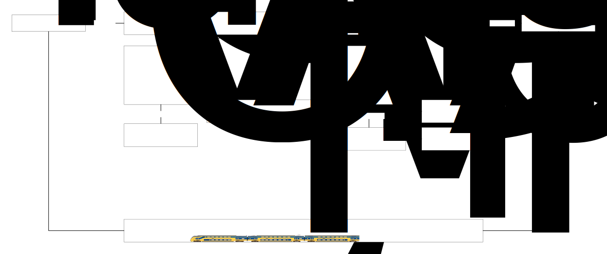

*Informatiekundig*

Dit scenario beschrijft een **rangeerbeweging**, gemodelleerd als een **treinbeweging van het type ‘rangeerbeweging’**, in combinatie met materieelopstellingen.

De rangeerbeweging start met een **vertrekgebeurtenis** vanuit een **opstelgebied of opstelspoor A**. Deze vertrekgebeurtenis kent **geen publieke vertrektijd**, maar wel een **vroegste en uiterste vertrektijd**. Deze tijdvensters zijn bedoeld om te borgen dat het materieel tijdig op het emplacement aanwezig is voor het uitvoeren van reizigershandelingen en het starten van een volgende treinbeweging van het type **vervoerbeweging**.

**Materieelopstelling 1** representeert de opstelling van het materieel in het **opstelgebied of -spoor A**. De rangeerbeweging fungeert als **afvoerende treinbeweging** van deze materieelopstelling, waarmee de spoorbezetting van **Materieelopstelling 1** eindigt.

Na uitvoering van de activiteit **‘rangeren’** vindt een **aankomstgebeurtenis** plaats op het **emplacement / Dienstregelpunt C**. Deze aankomst beëindigt de rangeerbeweging. De rangeerbeweging is hiermee de **aanvoerende treinbeweging** voor **Materieelopstelling 2**.

De aankomstgebeurtenis op Dienstregelpunt C initieert de activiteit **‘commercieel stoppen’**, ten behoeve van het instappen van reizigers en het wisselen van machinist.

In dit scenario vinden **geen splitsingen of combinaties** van materieel plaats.

*Gegevensuitwerking van het scenario*

Dit scenario is afgezien van het soort activiteit en verwijzing naar andere operationele punten nagenoeg gelijk aan voorgaande scenario.

## Kopmaken

In dit scenario maakt de trein **kop** tussen aankomst en vertrek. Kopmaken betekent dat een trein **in de tegenovergestelde richting vertrekt ten opzichte van de aankomstrichting**, zonder dat dit de eindbestemming is. De trein blijft daarbij bestaan uit **hetzelfde materieel** en rijdt door onder **hetzelfde treinnummer**.

Het kopmaken vindt plaats op **hetzelfde operationele punt**, in dit voorbeeld **Dienstregelpunt C**, en gebeurt tussen de gebeurtenissen **‘aankomst’** en **‘vertrek’**.

Bij de gebeurtenis **‘aankomst’** is de activiteit **‘kopmaken’** opgenomen. De treinbeweging stopt hierbij niet; de treinrit loopt door en blijft dezelfde trein. Er is daarom **geen sprake van materieelopstelling**. In dit scenario vindt namelijk geen materieeluitwisseling plaats en is er geen andere aanvoerende of afvoerende treinbeweging.

Het kopmaken gebeurt tijdens de **commerciële stop** op Dienstregelpunt C. Informatief gezien wordt hiermee vastgelegd dat de trein na vertrek **in de andere richting verder rijdt**, terwijl het voor reizigers één doorgaande trein blijft.

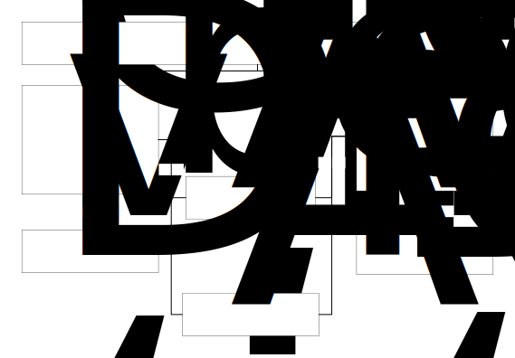

*Informatiekundig*

Dit scenario beschrijft **kopmaken** binnen een treinbeweging. Kopmaken is het vertrekken van een trein in **tegengestelde rijrichting** ten opzichte van de aankomstrichting, zonder dat sprake is van een eindbestemming, en **met behoud van materieel en treinidentificatie** (treinnummer).

Het kopmaken vindt plaats tussen de gebeurtenissen **‘aankomst’** en **‘vertrek’** op hetzelfde **operationele punt**, in dit scenario **Dienstregelpunt C**.

Aan de gebeurtenis **‘aankomst’** is de activiteit **‘kopmaken’** gekoppeld. Deze activiteit beëindigt de treinbeweging niet; de treinrit loopt door onder dezelfde treinidentificatie. Het opnemen van afzonderlijke **materieelopstellingen als planobjecten** is in dit scenario niet nodig, omdat:

- geen materieeluitwisseling plaatsvindt, en

- er geen andere aanvoerende of afvoerende treinbeweging betrokken is.

Het kopmaken vindt plaats **tijdens de commerciële stop** op Dienstregelpunt C. Informatiekundig kan dit gelijktijdig worden beschouwd met een activiteit van het type **‘commercieel stoppen’**, waarbij de aanvullende informatie wordt vastgelegd dat de daaropvolgende vertrekgebeurtenis in **tegengestelde richting** plaatsvindt.

*Gegevensuitwerking van dit scenario*

Treinbeweging

| Identificatie | treinnummer | typeBeweging    |    datum | bestaatUitGebeurtenis |
|---------------|-------------|-----------------|---------:|-----------------------|
| T1            | OTN001      | vervoerbeweging | 1-4-2026 | …, G3, G4, …          |

Gebeurtenis

| identificatie | type     | begintijd                        | vindtPlaatsOp |
|---------------|----------|----------------------------------|---------------|
| G3            | aankomst | PA 8:45am; VA 8:44am; UV: 8:47am | OP3           |
| G4            | vertrek  |                                  | OP3           |

Activiteit

| identificatie | soort | begintijd-eindtijd | beginGebeurtenis | eindGebeurtenis |
|----|----|----|----|----|
| A3 | commercieel stoppen | 8:45-8:50am | G3 | G4 |
| A5 | kopmaken | 8:45-8:48am | G3 | G4 |

Operationeel punt

| identificatie | naam              | Dienstregelpunt |
|---------------|-------------------|-----------------|
| OP3           | Dienstregelpunt C | Dienstregelpunt |

## Kopmaken lange trein met vertrek vanaf een ander spoor

In dit scenario wordt een situatie beschreven waarin een trein na aankomst wordt gekeerd en vervolgens vanaf een ander spoor vertrekt. De aankomst- en vertrekgebeurtenis vinden daardoor plaats op verschillende locaties binnen hetzelfde dienstregelpunt.

De trein arriveert op **Dienstregelpunt C, spoor 8A**. Na aankomst vindt een **commerciële stop** plaats voor het uitstappen en instappen van reizigers. Daarnaast wordt de activiteit **Kopmaken** uitgevoerd, waarmee de rijrichting van de trein wordt omgekeerd. Vervolgens vertrekt de trein vanaf **spoor 8B**.

In vergelijking met het voorgaande scenario, waarin aankomst en vertrek op hetzelfde spoor plaatsvinden, laat dit scenario zien dat de begin- en eindgebeurtenis van een stop- of keerproces niet noodzakelijk aan dezelfde locatie gekoppeld hoeven te zijn. Hierdoor kan het model ook situaties beschrijven waarin een trein tijdens de stop van perron- of spoorlocatie verandert, terwijl de materieelsamenstelling ongewijzigd blijft.

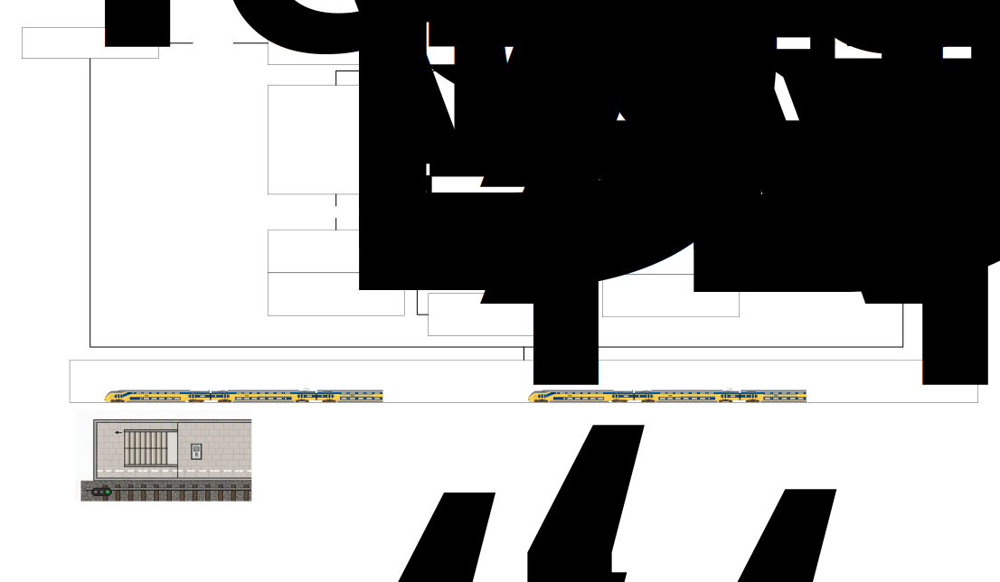

## Overgaan

In dit scenario wordt **overgaan** beschreven.

**Overgaan** betekent dat al het materieel van de ene trein volledig wordt ingezet voor een volgende trein. Het materieel gaat dus over van de ene treinrit naar de andere, zonder dat de materieelsamenstelling wijzigt.

Treinbeweging 1 is de **aanvoerende beweging** voor **materieelopstelling 1**. Deze materieelopstelling heeft een bepaalde **materieelsamenstelling**. Diezelfde materieelsamenstelling wordt vervolgens gebruikt voor **treinbeweging 2**.

Tussen treinbeweging 1 en treinbeweging 2 vindt een **materieeluitwisseling** plaats van het type **‘overgaan’**. De materieelopstelling vormt hierbij de schakel: zij wordt aangevoerd door treinbeweging 1 en afgevoerd door treinbeweging 2.

Omdat de materieelsamenstelling gelijk blijft, zijn de **bronopstelling en doelopstelling** van de materieeluitwisseling hetzelfde: **materieelopstelling 1**.

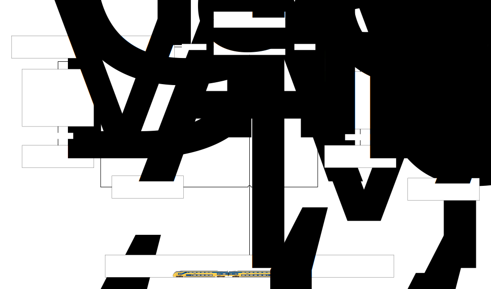

*Informatiekundig*

Dit scenario beschrijft het concept **overgaan** in samenhang met treinbewegingen, materieelopstellingen en materieeluitwisseling.

**Overgaan** betreft een materieeluitwisseling waarbij **de volledige materieelsamenstelling** van een aanvoerende beweging wordt ingezet in één afvoerende beweging. Het materieel gaat daarbij over van de ene treinbeweging naar de andere, zonder dat de materieelsamenstelling wijzigt.

**Treinbeweging 1**, van het type **vervoerbeweging**, kent een gebeurtenis **‘aankomst’** waarnaeen activiteit van het type **‘commercieel stoppen’** plaatsvindt.

Treinbeweging 1 fungeert als **aanvoerende treinbeweging** voor **materieelopstelling 1**, waaraan een **materieelsamenstelling** is gekoppeld. Dezelfde materieelsamenstelling wordt vervolgens ingezet voor **treinbeweging 2**.

Tussen treinbeweging 1 en treinbeweging 2 vindt een **materieeluitwisseling** plaats met handelingsoort **‘overgaan’**. Materieelopstelling 1 heeft hierbij zowel een **aanvoerende** (treinbeweging 1) als een **afvoerende treinbeweging** (treinbeweging 2).

Omdat de materieelsamenstelling ongewijzigd blijft, zijn de **bronopstelling** en **doelopstelling** van de materieeluitwisseling identiek en verwijzen beide naar **materieelopstelling 2**.

*Gegevensuitwerking bij dit scenario*

Treinbeweging

| identificatie | treinnummer | typeBeweging    |    datum | bestaatUitGebeurtenis |
|---------------|-------------|-----------------|---------:|-----------------------|
| T1            | OTN001      | vervoerbeweging | 1-4-2026 | …, G3                 |
| T2            | OTN002      | vervoerbeweging | 1-4-2026 | G4, …                 |

Gebeurtenis

| identificatie | type     | begintijd                        | vindtPlaatsOp |
|---------------|----------|----------------------------------|---------------|
| G3            | aankomst | PA 8:45am; VA 8:44am; UV: 8:47am | OP3           |
| G4            | vertrek  | PV 8:50am; VV 8:50am; UV: 8:52am | OP3           |

Activiteit

| identificatie | soort | begintijd-eindtijd | beginGebeurtenis | eindGebeurtenis |
|----|----|----|----|----|
| A3 | commercieel stoppen | 8:45-8:50am | G3 | G4 |
| *A7* | *reizigers vervoeren* | *8:50-9:30am* | *G4* | *…* |

Operationeel punt

| identificatie | naam              | Dienstregelpunt |
|---------------|-------------------|-----------------|
| OP3           | Dienstregelpunt C | Dienstregelpunt |

Materieelopstelling

<table>
<colgroup>
<col style="width: 12%" />
<col style="width: 10%" />
<col style="width: 25%" />
<col style="width: 24%" />
<col style="width: 27%" />
</colgroup>
<thead>
<tr>
<th>identificatie</th>
<th style="text-align: right;">datum</th>
<th>
aanvoerende

Treinbeweging
</th>
<th>
afvoerende

Treinbeweging
</th>
<th>
steltOp

Materieelsamenstelling
</th>
</tr>
</thead>
<tbody>
<tr>
<td>MO1</td>
<td style="text-align: right;"><em>1-4-2026</em></td>
<td>T1</td>
<td>T2</td>
<td>MS1</td>
</tr>
</tbody>
</table>

Materieelsamenstelling

| identificatie | materieel | treinstel |
|---------------|-----------|----------:|
| MS1           | VIRM4     |      9565 |

Materieeluitwisseling

| identificatie | handelingsoort | bronOpstelling | doelOpstelling |
|---------------|----------------|----------------|----------------|
| MU1           | **overgaan**   | MO1            | MO1            |

## Keren

In dit scenario wordt **keren** beschreven.

Keren betekent dat een trein op zijn eindbestemming aankomt en daarna met hetzelfde materieel, maar onder een ander treinnummer, in tegengestelde richting wordt ingezet. Daarbij wordt de volgorde van het materieel omgekeerd ten opzichte van de oorspronkelijke rijrichting (bijvoorbeeld van A‑Z naar Z‑A)

In dit scenario eindigt treinbeweging 1, een vervoerbeweging, met een aankomst. Na deze aankomst worden activiteiten uitgevoerd, zoals commercieel stoppen zodat reizigers kunnen uitstappen en de activiteit keren, waarmee wordt vastgelegd dat het materieel vervolgens in de tegenovergestelde richting wordt ingezet.

Treinbeweging 1 is de aanvoerende beweging voor materieelopstelling 1. Deze materieelopstelling heeft een bepaalde materieelsamenstelling. Na de aankomst ontstaat een nieuwe materieelopstelling van waaruit treinbeweging 2 wordt gestart.

Tussen beide materieelopstellingen vindt een materieeluitwisseling plaats van het type **keren**. De materieelsamenstelling blijft daarbij ongewijzigd. Het materieel gaat over naar een volgende treinbeweging, waarbij de rijrichting ten opzichte van de voorgaande treinbeweging wordt omgekeerd.

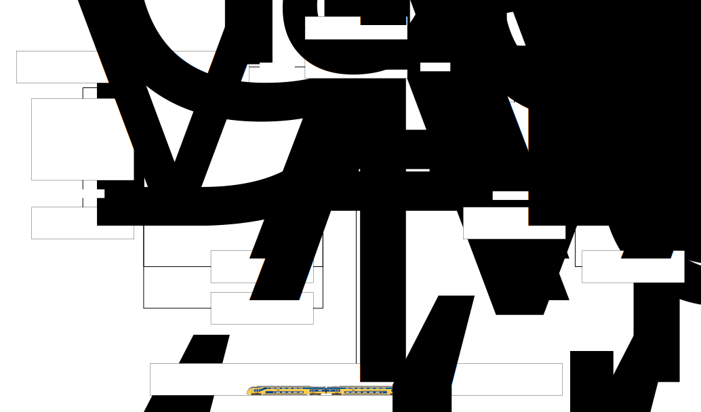

*Informatiekundig*

Dit scenario beschrijft het concept **keren** in samenhang met treinbewegingen, materieelopstellingen en materieeluitwisseling.

Keren is een vorm van materieeluitwisseling waarbij een trein op zijn eindbestemming aankomt en daarna met hetzelfde materieel, maar onder een andere treinidentificatie, in tegengestelde rijrichting wordt ingezet.

Treinbeweging 1, van het type vervoerbeweging, kent een gebeurtenis **aankomst** waarna twee activiteiten plaatsvinden:

- een activiteit van het type **commercieel stoppen**, zodat reizigers kunnen uitstappen;

- een activiteit van het type **keren**, waarmee wordt vastgelegd dat het materieel vervolgens in de tegenovergestelde rijrichting wordt ingezet.

Treinbeweging 1 fungeert als aanvoerende treinbeweging voor materieelopstelling 1. Op basis van deze materieelopstelling ontstaat na de materieeluitwisseling een nieuwe materieelopstelling, die wordt afgevoerd door treinbeweging 2.

Tussen beide materieelopstellingen vindt een materieeluitwisseling plaats met handelingsoort **keren**. De materieelsamenstelling blijft daarbij ongewijzigd.

Omdat een nieuwe operationele situatie ontstaat, zijn bronopstelling en doelopstelling van de materieeluitwisseling verschillend en verwijzen zij respectievelijk naar materieelopstelling 1 en materieelopstelling 2.

*Gegevensuitwerking bij dit scenario*

Treinbeweging

| identificatie | treinnummer | typeBeweging    |    datum | bestaatUitGebeurtenis |
|---------------|-------------|-----------------|---------:|-----------------------|
| T1            | OTN001      | vervoerbeweging | 1-4-2026 | …, G3                 |
| T2            | OTN002      | vervoerbeweging | 1-4-2026 | G4, …                 |

Gebeurtenis

| identificatie | type | begintijd | vindtPlaatsOp | initieertActiviteit |
|----|----|----|----|----|
| G3 | aankomst | PA 8:45am; VA 8:44am; UV: 8:47am | OP3 | A3, A6 |
| G4 | vertrek | PV 8:50am; VV 8:50am; UV: 8:52am | OP3 | A7 |

Activiteit

| identificatie | soort | begintijd-eindtijd | beginGebeurtenis | eindGebeurtenis |
|----|----|----|----|----|
| A3 | commercieel stoppen | 8:45-8:50am | G3 | G4 |
| A6 | **keren** | 8:45-8:48am | G3 | G4 |
| *A7* | *reizigers vervoeren* | */8:50-9:30am* | *G4* | *…* |

Operationeel punt

| identificatie | naam              | type            |
|---------------|-------------------|-----------------|
| OP3           | Dienstregelpunt C | Dienstregelpunt |

Materieelopstelling

<table>
<colgroup>
<col style="width: 12%" />
<col style="width: 10%" />
<col style="width: 25%" />
<col style="width: 24%" />
<col style="width: 27%" />
</colgroup>
<thead>
<tr>
<th>identificatie</th>
<th style="text-align: right;">datum</th>
<th>
aanvoerende

Treinbeweging
</th>
<th>
afvoerende

Treinbeweging
</th>
<th>
steltOp

Materieelsamenstelling
</th>
</tr>
</thead>
<tbody>
<tr>
<td>MO1</td>
<td style="text-align: right;"><em>1-4-2026</em></td>
<td>T1</td>
<td>T2</td>
<td>MS1</td>
</tr>
</tbody>
</table>

Materieelsamenstelling

| identificatie | materieel | treinstel |
|---------------|-----------|----------:|
| MS1           | VIRM4     |      9565 |

Materieeluitwisseling

| identificatie | handelingsoort | bronOpstelling | doelOpstelling |
|---------------|----------------|----------------|----------------|
| MU1           | **keren**      | MO1            | MO1            |

## Combineren

In dit scenario wordt materieel van **twee treinbewegingen gecombineerd** tot één nieuwe trein voor verdere inzet.

**Treinbeweging 1**, een vervoerbeweging, arriveert met **materieelopstelling 1** en **materieelsamenstelling 1**. Daarnaast arriveert **treinbeweging 2**, een rangeerbeweging, met extra materieel dat bedoeld is om aan de oorspronkelijke trein toe te voegen.

Tijdens de materieelopstelling worden deze twee materieeldelen **samengevoegd (gecombineerd)**. Het resultaat is één nieuwe trein met een **nieuwe materieelsamenstelling** (materieelsamenstelling 3), die vervolgens wordt ingezet voor het vervolg van **treinbeweging 1**.

Na het combineren rijdt treinbeweging 1 verder met het gecombineerde materieel. Treinbeweging 2 eindigt na het aanleveren van het materieel.

Dit scenario is het spiegelbeeld van een splits-scenario: in plaats van één trein die uiteenvalt in meerdere delen, worden hier meerdere materieeldelen samengebracht tot één trein.

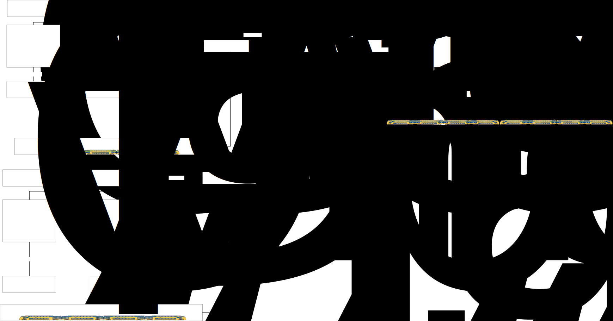

*Informatiekundig*

Dit scenario beschrijft een materieelcombinatie waarbij materieel uit **twee treinbewegingen** wordt samengebracht in één nieuwe materieelsamenstelling.

**Treinbeweging 1** (type **vervoerbeweging**) heeft **Materieelopstelling 1** met **Materieelsamenstelling 1**.\
**Treinbeweging 2** (type **rangeerbeweging**) levert materieel aan via een aparte materieelopstelling.

Tijdens de materieelopstelling vindt **Materieeluitwisseling 1** plaats met handelingsoort **‘combineren’**. Deze materieeluitwisseling kent:

- **twee bronopstellingen**:

  - Materieelopstelling 1 (van Treinbeweging 1)

  - Materieelopstelling 2 (van Treinbeweging 2)

- **één doelopstelling**:

  - Materieelopstelling 3

Materieelopstelling 3 heeft **Materieelsamenstelling 3**, die het samengestelde materieel representeert. Deze materieelsamenstelling wordt ingezet voor het vervolg van **Treinbeweging 1**.

Treinbeweging 1 fungeert daarmee als **afvoerende treinbeweging** van Materieelopstelling 3.\
Treinbeweging 2 eindigt na het aanleveren van het materieel en heeft geen verdere afvoerende treinbeweging.

*Gegevensuitwerking voor dit scenario*

Treinbeweging

| identificatie | treinnummer | typeBeweging    |    datum | bestaatUitGebeurtenis |
|---------------|-------------|-----------------|---------:|-----------------------|
| T1            | OTN001      | vervoerbeweging | 1-4-2026 | G1,G2,G3,G6,G7,G8     |
| T2            | OTN002      | rangeerbeweging | 1-4-2026 | G4, G5                |

Gebeurtenis

<table style="width:70%;">
<colgroup>
<col style="width: 13%" />
<col style="width: 12%" />
<col style="width: 27%" />
<col style="width: 16%" />
</colgroup>
<thead>
<tr>
<th>identificatie</th>
<th>type</th>
<th>tijdOplocatie</th>
<th>vindtPlaatsOp</th>
</tr>
</thead>
<tbody>
<tr>
<td>G1</td>
<td>vertrek</td>
<td>
PV 8:28am

VV 8:28am

UV 8:32am

WV «waardeOnbekend»
</td>
<td>OP1</td>
</tr>
<tr>
<td>G2</td>
<td>doorkomst</td>
<td>
PV --

VD 8:38am

UD 8:40am

WD «waardeOnbekend»
</td>
<td>OP2</td>
</tr>
<tr>
<td>G3</td>
<td>aankomst</td>
<td>
PA 8:45am

VA 8:44am

UA 8:47am

WD «waardeOnbekend»
</td>
<td>OP3</td>
</tr>
<tr>
<td>G4</td>
<td>vertrek</td>
<td>
PV ---

VV 8:40am

UV 8:43am

WV «waardeOnbekend
</td>
<td>OP6</td>
</tr>
<tr>
<td>G5</td>
<td>aankomst</td>
<td>
PA ---

VA 8:47m

UA 8:48am

WA «waardeOnbekend»
</td>
<td>OP3</td>
</tr>
<tr>
<td>G6</td>
<td>vertrek</td>
<td>
PV 8:50am

VV 8:50am

UV 8:52am

WV «waardeOnbekend»
</td>
<td>OP3</td>
</tr>
<tr>
<td>G7</td>
<td>doorkomst</td>
<td style="text-align: left;">
---

VD 9:00am

UD 9:01am

WD «waardeOnbekend»
</td>
<td>OP4</td>
</tr>
<tr>
<td>G8</td>
<td>aankomst</td>
<td style="text-align: left;">
PA 9:15am

VA 9:14am

UA 8:16am

WD «waardeOnbekend»
</td>
<td>OP5</td>
</tr>
</tbody>
</table>

Operationeel punt

| identificatie | naam                  | type            |
|---------------|-----------------------|-----------------|
| OP1           | Dienstregelpunt A     | Dienstregelpunt |
| OP2           | Dienstregelpunt B     | Dienstregelpunt |
| OP3           | Dienstregelpunt C     | Dienstregelpunt |
| OP4           | Dienstregelpunt D     | Dienstregelpunt |
| OP5           | Dienstregelpunt E     | Dienstregelpunt |
| OP6           | Opstelgebied/-spoor A | Opstel          |

Materieelopstelling

<table style="width:85%;">
<colgroup>
<col style="width: 13%" />
<col style="width: 10%" />
<col style="width: 16%" />
<col style="width: 18%" />
<col style="width: 26%" />
</colgroup>
<thead>
<tr>
<th>identificatie</th>
<th style="text-align: right;">datum</th>
<th>
aanvoerende

Treinbeweging
</th>
<th>
afvoerende

Treinbeweging
</th>
<th>
steltop

Materieelsamenstelling
</th>
</tr>
</thead>
<tbody>
<tr>
<td>MO1</td>
<td style="text-align: right;">1-4-2026</td>
<td>T1</td>
<td>/T1</td>
<td>MS1</td>
</tr>
<tr>
<td>MO2</td>
<td style="text-align: right;">1-4-2026</td>
<td>T2</td>
<td>/T1</td>
<td>MS2</td>
</tr>
<tr>
<td>MO3</td>
<td style="text-align: right;">1-4-2026</td>
<td>/T1,/T2</td>
<td>T1</td>
<td>MS3</td>
</tr>
</tbody>
</table>

Materieelsamenstelling

| identificatie | materieel   |  treinstel |
|---------------|-------------|-----------:|
| MS1           | VIRM4       |       9565 |
| MS2           | VIRM4       |       9566 |
| MS3           | VIRM4+VIRM4 | 9565, 9566 |

Materieeluitwisseling

| identificatie | handelingsoort | bronOpstelling | doelOpstelling |
|---------------|----------------|----------------|----------------|
| MU1           | **combineren** | MO1,MO2        | MO3            |

## Splitsen en afrangeren

In dit scenario wordt het materieel van een trein **gesplitst**, waarbij een deel van het materieel wordt **afgerangeerd**. De nadruk ligt hierbij op **de materieeluitwisseling** en op de samenhang tussen **treinbewegingen**, **materieelopstellingen** en **materieelsamenstellingen**. Daarom zijn de gebeurtenissen vereenvoudigd tot alleen hun type; tijden en bijbehorende activiteiten zijn niet uitgewerkt.

**Treinbeweging 1** komt aan met een **aankomst** en is daarmee de **aanvoerende treinbeweging** voor **materieelopstelling 1**. Deze materieelopstelling heeft één oorspronkelijke samenstelling: **VIRM4 + VIRM4**.

Tijdens de materieelopstelling wordt het materieel **gesplitst**. Dat leidt tot twee nieuwe materieelopstellingen, elk met een eigen samenstelling:

- **Materieelopstelling 2** met **VIRM4**

- **Materieelopstelling 3** met **VIRM4**

Na de splitsing zijn er dus twee afzonderlijke materieeldelen ontstaan. Vanuit deze materieelopstellingen kunnen vervolgens afzonderlijke treinbewegingen worden gestart. Hiermee blijft expliciet zichtbaar dat beide uitgaande treinbewegingen afhankelijk zijn van dezelfde aanvoerende treinbeweging.

De oorspronkelijke materieelopstelling 1 wordt aangevoerd door treinbeweging 1. Welke treinbewegingen het materieel afvoeren, volgt uit wat er met de nieuwe materieelopstellingen gebeurt:

- Eén deel blijft gekoppeld aan **treinbeweging 1**

- Het andere deel wordt afgevoerd via **treinbeweging 2**

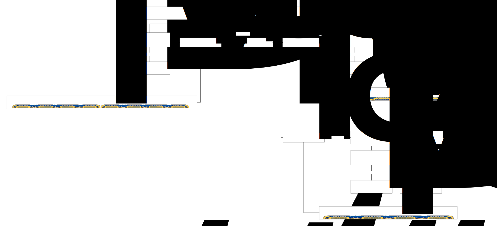

*Informatiekundig*

Dit scenario beschrijft een materieelsplitsing bij een treinbeweging, waarbij een deel van het materieel wordt afgerangeerd. De focus ligt op de **materieeluitwisseling** en de relaties tussen **materieelopstellingen**, **materieelsamenstellingen** en **treinbewegingen**. Gebeurtenissen zijn daarom gemodelleerd als typen, zonder verdere detaillering van tijdstippen of activiteiten.

**Treinbeweging 1** kent een gebeurtenis van het type **‘aankomst’** en fungeert als **aanvoerende treinbeweging** voor **materieelopstelling 1**. Materieelopstelling 1 heeft als oorspronkelijke samenstelling **Materieelsamenstelling 1: VIRM4 + VIRM4**.

Tijdens de materieelopstelling vindt een **materieeluitwisseling** plaats van het handelingstype **‘splitsen’**. Informatiekundig resulteert dit in:

- één **bronopstelling**: **Materieelopstelling 1**, en

- twee **doelopstellingen**: **Materieelopstelling 2** en **Materieelopstelling 3**.

De doelopstellingen hebben elk een eigen materieelsamenstelling:

- **Materieelsamenstelling 2: VIRM4** (Materieelopstelling 2)

- **Materieelsamenstelling 3: VIRM4** (Materieelopstelling 3)

Materieelopstelling 1 heeft als aanvoerende treinbeweging **Treinbeweging 1**. De afvoerende treinbewegingen kunnen worden afgeleid via de materieeluitwisseling:

- **Materieelopstelling 2** wordt afgevoerd via **Treinbeweging 1**

- **Materieelopstelling 3** wordt afgevoerd via **Treinbeweging 2**

*Gegevensuitwerking voor dit scenario*

Treinbeweging

| identificatie | treinnummer | typeBeweging    |    datum | bestaatUitGebeurtenis |
|---------------|-------------|-----------------|---------:|-----------------------|
| T1            | OTN001      | vervoerbeweging | 1-4-2026 | G1,G2,G3,G4           |
| T2            | OTN002      | rangeerbeweging | 1-4-2026 | G5, G6                |

Gebeurtenis

| identificatie | type      | vindtPlaatsOp |
|---------------|-----------|---------------|
| G1            | aankomst  | OP3           |
| G2            | vertrek   | OP3           |
| G3            | doorkomst | OP4           |
| G4            | aankomst  | OP5           |
| G5            | vertrek   | OP3           |
| G6            | aankomst  | OP6           |

Operationeel punt

| identificatie | naam                  | type            |
|---------------|-----------------------|-----------------|
| OP3           | Dienstregelpunt C     | Dienstregelpunt |
| OP4           | Dienstregelpunt D     | Dienstregelpunt |
| OP5           | Dienstregelpunt E     | Dienstregelpunt |
| OP6           | Opstelgebied/-spoor A | Opstel          |

Materieelopstelling

<table style="width:85%;">
<colgroup>
<col style="width: 13%" />
<col style="width: 10%" />
<col style="width: 16%" />
<col style="width: 18%" />
<col style="width: 26%" />
</colgroup>
<thead>
<tr>
<th>identificatie</th>
<th style="text-align: right;">datum</th>
<th>
aanvoerende

Treinbeweging
</th>
<th>
afvoerende

Treinbeweging
</th>
<th>
steltop

Materieelsamenstelling
</th>
</tr>
</thead>
<tbody>
<tr>
<td>MO1</td>
<td style="text-align: right;">1-4-2026</td>
<td>T1</td>
<td>/T1</td>
<td>MS1</td>
</tr>
<tr>
<td>MO2</td>
<td style="text-align: right;">1-4-2026</td>
<td>/T1</td>
<td>T1</td>
<td>MS2</td>
</tr>
<tr>
<td>MO3</td>
<td style="text-align: right;">1-4-2026</td>
<td>/T1</td>
<td>T2</td>
<td>MS3</td>
</tr>
</tbody>
</table>

Materieelsamenstelling

| identificatie | materieel   | treinstel  |
|---------------|-------------|------------|
| MS1           | VIRM4+VIRM4 | 9565, 9566 |
| MS2           | VIRM4       | 9565       |
| MS3           | VIRM4       | 9566       |

Materieeluitwisseling

| identificatie | handelingsoort | bronOpstelling | doelOpstelling |
|---------------|----------------|----------------|----------------|
| MU1           | **splitsen**   | MO1            | MO2, MO3       |

## Splitsen in drie delen

In dit scenario arriveert een trein die bestaat uit **drie VIRM4-stellen**. Deze trein wordt **in drie delen gesplitst**, waarbij elk deel een andere vervolgstap krijgt:

- Eén deel blijft onderdeel van de **oorspronkelijke treinbeweging 1** en rijdt verder als **intercity**.

- Eén deel gaat verder in een **nieuwe treinbeweging 2** van het type **vervoerbeweging**, en rijdt door als **stoptrein**.

- Het derde deel wordt **afgerangeerd** en gaat verder in een **nieuwe treinbeweging 3** van het type **rangeerbeweging**.

Dit scenario is vrijwel gelijk aan het voorgaande scenario met splitsen. Het verschil is dat het materieel nu niet in twee maar in **drie delen** uiteenvalt. Dat betekent dat er na de splitsing **drie afzonderlijke materieelopstellingen** ontstaan, elk met een eigen materieelsamenstelling.

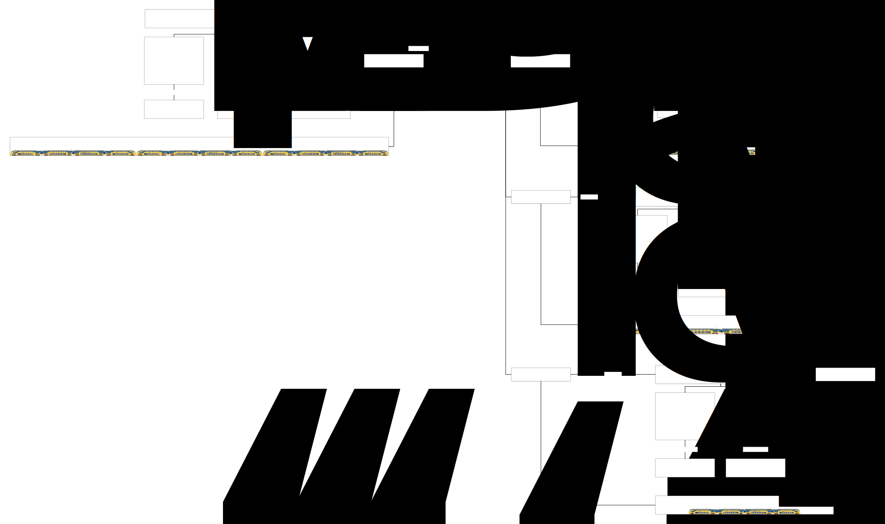

*Informatiekundig*

Dit scenario beschrijft een materieelsplitsing waarbij een trein met **Materieelsamenstelling 1: 3×VIRM4** wordt opgesplitst in drie afzonderlijke delen, die elk in een eigen treinbeweging worden ingezet.

**Materieeluitwisseling 1** heeft als **bronopstelling** **Materieelopstelling 1** en kent **drie doelopstellingen** (in plaats van twee), namelijk:

- **Materieelopstelling 2**, gekoppeld aan de voortzetting van **Treinbeweging 1** (vervoerbeweging, intercity);

- **Materieelopstelling 3**, ingezet in **Treinbeweging 2** van het type **vervoerbeweging** (stoptrein);

- **Materieelopstelling 4**, ingezet in **Treinbeweging 3** van het type **rangeerbeweging** (afrangeren).

Elke doelopstelling heeft een eigen **materieelsamenstelling**, voortkomend uit de materieeluitwisseling met handelingsoort **‘splitsen’**. De oorspronkelijke materieelopstelling fungeert hierbij als bron voor alle drie de nieuwe opstellingen.

*Gegevensuitwerking bij dit scenario*

Treinbeweging

| identificatie | treinnummer | typeBeweging    |    datum | bestaatUitGebeurtenis |
|---------------|-------------|-----------------|---------:|-----------------------|
| T1            | OTN001      | vervoerbeweging | 1-4-2026 | G1,G2,G3,G4           |
| T2            | OTN002      | vervoerbeweging | 1-4-2026 | G5, G6                |
| T3            | OTN003      | rangeerbeweging | 1-4-2026 | G7, G8                |

Gebeurtenis

| identificatie | type      | vindtPlaatsOp |
|---------------|-----------|---------------|
| G1            | aankomst  | OP3           |
| G2            | vertrek   | OP3           |
| G3            | doorkomst | OP4           |
| G4            | aankomst  | OP5           |
| G5            | vertrek   | OP3           |
| G6            | aankomst  | OP4           |
| G7            | vertrek   | OP3           |
| G8            | aankomst  | OP6           |

Operationeel punt

| identificatie | naam                  | type            |
|---------------|-----------------------|-----------------|
| OP3           | Dienstregelpunt C     | Dienstregelpunt |
| OP4           | Dienstregelpunt D     | Dienstregelpunt |
| OP5           | Dienstregelpunt E     | Dienstregelpunt |
| OP6           | Opstelgebied/-spoor A | Opstel          |

Materieelopstelling

| identificatie | datum | aanvoerendeTreinbeweging | afvoerendeTreinbeweging | steltopMaterieelsamenstelling |
|----|---:|----|----|----|
| MO1 | 1-4-2026 | T1 | /T1 | MS1 |
| MO2 | 1-4-2026 | /T1 | T1 | MS2 |
| MO3 | 1-4-2026 | /T1 | T2 | MS3 |
| MO4 | 1-4-2026 | /T1 | T3 | MS4 |

Materieelsamenstelling

| identificatie | materieel   | treinstel        |
|---------------|-------------|------------------|
| MS1           | VIRM4+VIRM4 | 9565, 9566, 9567 |
| MS2           | VIRM4       | 9565             |
| MS3           | VIRM4       | 9566             |
| MS4           | VIRM4       | 9567             |

Materieeluitwisseling

| identificatie | handelingsoort | bronOpstelling | doelOpstelling |
|---------------|----------------|----------------|----------------|
| MU1           | splitsen       | MO1            | MO2, MO3, MO4  |

## Splitsen, Splitsen, Combineren

In dit scenario komen twee treinen, beide met de treinsamenstelling VIRM4+VIRM4, op een emplacement tot stilstand. Tijdens deze stilstand vindt materieeluitwisseling plaats:

- Splitsen: Bij Treinbeweging 1 (rood) wordt één VIRM4-treindeel afgekoppeld. De trein maakt kop en vertrekt onder hetzelfde treinnummer.

- Splitsen: Bij Treinbeweging 2 (groen) wordt eveneens één VIRM4-treindeel afgekoppeld. De trein keert en vertrekt onder een nieuw treinnummer als Treinbeweging 3 (oranje).

- Combineren: De afgekoppelde VIRM4-treindelen van Treinbeweging 1 en Treinbeweging 2 worden samengevoegd tot één nieuwe trein, die onder een nieuw treinnummer vertrekt als Treinbeweging 4 (paars).

> 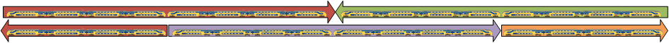

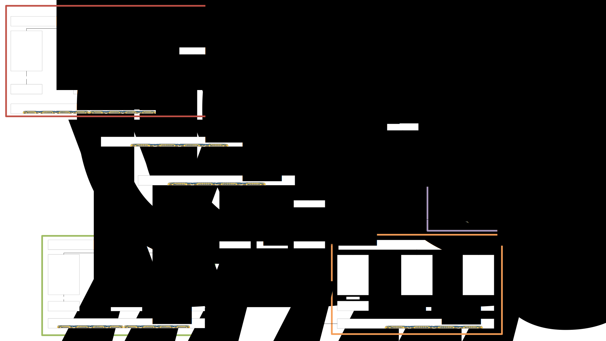

## Locomotief omlopen

In dit scenario wordt **locomotief omlopen** beschreven.

Locomotief omlopen betekent dat een locomotief wordt losgekoppeld van een trein, via een rangeerbeweging naar de andere zijde van de trein wordt verplaatst en daar opnieuw wordt gekoppeld. Hierdoor kan dezelfde trein in tegengestelde richting vertrekken zonder dat de samenstelling van de wagons wijzigt.

In dit scenario eindigt treinbeweging 1, een vervoerbeweging, met een aankomst. Na deze aankomst vinden activiteiten plaats, zoals de activiteit ‘kopmaken’ en de activiteit ‘locomotief omlopen’.

Tijdens de materieelopstelling wordt de locomotief afgesplitst van de wagons. Hierdoor ontstaan twee materieelopstellingen:

- een materieelopstelling met de locomotief;

- een materieelopstelling met de wagons.

De locomotief wordt vervolgens via een rangeerbeweging verplaatst naar de andere zijde van de wagons. Daarna worden locomotief en wagons opnieuw gecombineerd tot één materieelsamenstelling.

Vanuit deze nieuwe materieelopstelling gaat vervolgens treinbeweging 1 door.

*Informatiekundig*

Dit scenario beschrijft het concept locomotief omlopen in samenhang met treinbewegingen, materieelopstellingen, materieeluitwisselingen en rangeerbewegingen.

Treinbeweging 1, van het type vervoerbeweging, kent een gebeurtenis aankomst waarna activiteiten plaatsvinden van het type ‘kopmaken’ en ‘locomotief omlopen’.

Treinbeweging 1 fungeert als aanvoerende treinbeweging voor materieelopstelling 1. Aan deze materieelopstelling is een materieelsamenstelling gekoppeld die bestaat uit een locomotief en wagons.

Vanuit materieelopstelling 1 vindt een materieeluitwisseling plaats met handelingsoort splitsen. Daarbij ontstaan:

- materieelopstelling 2 met de wagons;

- materieelopstelling 3 met uitsluitend de locomotief.

Materieelopstelling 3 wordt afgevoerd door een rangeerbeweging. Deze rangeerbeweging vormt de aanvoerende treinbeweging voor materieelopstelling 4, waarin de locomotief zich aan de andere zijde van de trein bevindt.

Vervolgens vindt een materieeluitwisseling plaats met handelingsoort combineren, waarbij de locomotief uit materieelopstelling 4 en de wagons uit materieelopstelling 2 worden samengevoegd tot materieelopstelling 5.

Vanuit materieelopstelling 5 gaat treinbeweging 1 door met een vertrekgebeurtenis.

*Gegevensuitwerking bij dit scenario*

Treinbeweging

| identificatie | treinnummer | typeBeweging    |    datum | bestaatUitGebeurtenis |
|---------------|-------------|-----------------|---------:|-----------------------|
| T1            | OTN001      | vervoerbeweging | 1-4-2026 | G1, G4                |
| T2            | OTN002      | rangeerbeweging | 1-4-2026 | G2, G3                |

Gebeurtenis

| identificatie | type     | begintijd             | vindtPlaatsOp |
|---------------|----------|-----------------------|---------------|
| G1            | aankomst | VA 8:44am; UA: 8:48am | OP1           |
| G2            | vertrek  | VV 9:00am; UV: 9:02am | OP1           |
| G3            | aankomst | VA 9:10am; UA: 9:15am | OP1           |
| G4            | vertrek  | VV 9:15am; UV: 9:20am | OP1           |

Activiteit

| identificatie | soort | begintijd-eindtijd | beginGebeurtenis | eindGebeurtenis |
|----|----|----|----|----|
| A1 | kopmaken | 8:45-8:48am | G1 | G4 |
| A2 | locomotief afkoppelen | 8:45-8:48am | G1 | G2 |
| A3 | **locomotief omlopen** | 9:00-9:15am | G2 | G3 |

Operationeel punt

| identificatie | naam                | Type   |
|---------------|---------------------|--------|
| OP3           | TRS-gebied/-spoor A | Gebied |

Materieelopstelling

<table>
<colgroup>
<col style="width: 12%" />
<col style="width: 10%" />
<col style="width: 25%" />
<col style="width: 24%" />
<col style="width: 27%" />
</colgroup>
<thead>
<tr>
<th>identificatie</th>
<th style="text-align: right;">datum</th>
<th>
aanvoerende

Treinbeweging
</th>
<th>
afvoerende

Treinbeweging
</th>
<th>
steltOp

Materieelsamenstelling
</th>
</tr>
</thead>
<tbody>
<tr>
<td>MO1</td>
<td style="text-align: right;"><em>1-4-2026</em></td>
<td>T1</td>
<td>T2</td>
<td>MS1</td>
</tr>
<tr>
<td>MO2</td>
<td style="text-align: right;"><em>1-4-2026</em></td>
<td>T1</td>
<td>T1</td>
<td>MS2</td>
</tr>
<tr>
<td>MO3</td>
<td style="text-align: right;"><em>1-4-2026</em></td>
<td>T1</td>
<td>T2</td>
<td>MS3</td>
</tr>
<tr>
<td>MO4</td>
<td style="text-align: right;"><em>1-4-2026</em></td>
<td>T2</td>
<td>T1</td>
<td>MS3</td>
</tr>
<tr>
<td>MO5</td>
<td style="text-align: right;"><em>1-4-2026</em></td>
<td>T1</td>
<td>T1</td>
<td>MS4</td>
</tr>
</tbody>
</table>

Materieelsamenstelling

| identificatie | materieel          |
|---------------|--------------------|
| MS1           | Elek. Loc + Wagons |
| MS2           | Wagons             |
| MS3           | Elek. Loc          |
| MS4           | Wagons + Elek. Loc |

Materieeluitwisseling

| identificatie | handelingsoort | bronOpstelling | doelOpstelling |
|---------------|----------------|----------------|----------------|
| MU1           | **splitsen**   | MO1            | MO2, MO3       |
| MU2           | **combineren** | MO2, MO4       | MO5            |

## Uiteennemen c.q. splitsen van een binnenkomende goederentrein 

Een internationale goederentrein komt aan op een terminalspoor. Na aankomst wordt de aanvoerende locomotief afgekoppeld en vertrekt deze. Vervolgens wordt de trein in drie delen gesplitst: een voorste deel, een middendeel en een achterste deel.

De drie treindelen verlaten het spoor niet tegelijkertijd. Achtereenvolgens wordt eerst het voorste deel afgevoerd, daarna het achterste deel en tenslotte het middendeel. Voor elk treindeel wordt een afzonderlijke afvoerende treinbeweging uitgevoerd.

Gedurende dit proces verandert de samenstelling van het materieel op het spoor. Direct na de aankomst bevindt de volledige trein zich nog op het spoor. Na het splitsen ontstaan drie afzonderlijke treindelen die onafhankelijk van elkaar kunnen worden weggevoerd. Naarmate de afzonderlijke delen vertrekken, neemt de spoorbezetting af totdat uiteindelijk ook het laatste deel is afgevoerd en het spoor weer vrij is.

Het scenario laat zien dat spoorbezetting niet alleen wordt bepaald door aankomsten en vertrekken van complete treinen, maar vooral door de aanwezigheid van materieel op het spoor gedurende de tussenliggende rangeer-, splits- en combineeractiviteiten.

Een bijzonder geval ontstaat wanneer de locomotief voor het afvoeren van het middendeel niet arriveert. In dat geval vertrekken het voorste en achterste deel wel, maar blijft het middendeel achter op het spoor. Hierdoor blijft een spoorbezetting bestaan, ondanks het feit dat een groot deel van de oorspronkelijke trein al is afgevoerd.

***Informatiekundig***

De aankomst van de internationale trein resulteert in één materieelopstelling. Door de materieeluitwisseling *splitsen* ontstaan vervolgens vier nieuwe materieelopstellingen: de loc, het voorste, middelste en achterste treindeel. Elk van deze materieelopstellingen vormt de basis voor een afzonderlijke afvoerende treinbeweging.

Omdat alle objecten via relaties met elkaar verbonden zijn, kan de volledige keten van oorzaak en gevolg worden gevolgd:

- aankomst van de trein;

- vorming van een materieelopstelling;

- splitsing in drie materieelopstellingen;

- afzonderlijke afvoerende treinbewegingen;

- verdwijnen van de betreffende materieelopstellingen van het spoor.

Hierdoor kan ook worden afgeleid welke materieelopstellingen nog aanwezig zijn wanneer een geplande afvoer niet plaatsvindt.

Wanneer de afvoerende locomotief voor het middendeel niet arriveert, ontbreekt de bijbehorende afvoerende treinbeweging. De materieelopstelling van het middendeel wordt daardoor niet afgevoerd en blijft bestaan.

Doordat de materieelopstelling nog aanwezig is en geen opvolgende afvoerrelatie heeft, kan worden vastgesteld dat het betreffende treindeel nog op het spoor staat. De resterende spoorbezetting hoeft daarbij niet expliciet te worden geregistreerd; zij kan worden afgeleid uit de samenhang tussen:

- treinbewegingen;

- materieelopstellingen;

- materieeluitwisselingen;

- aankomst- en vertrekgebeurtenissen.

Het model maakt daarmee zichtbaar dat een ontbrekende afvoerende treinbeweging direct leidt tot een resterende materieelopstelling en dus tot een blijvende spoorbezetting. Hierdoor kunnen operationele situaties, zoals achtergebleven treindelen of onverwachte bezettingen van sporen, op basis van de geregistreerde relaties automatisch worden vastgesteld.

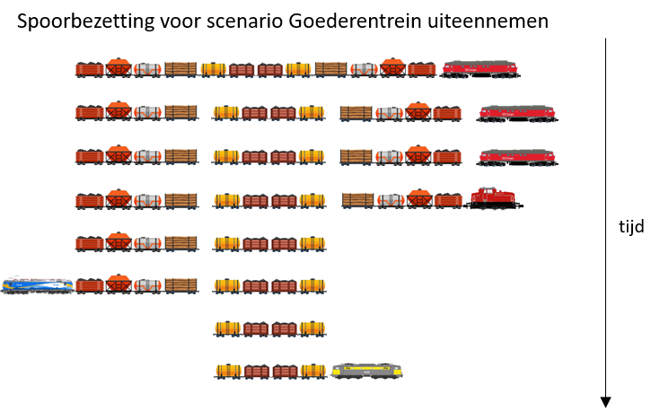

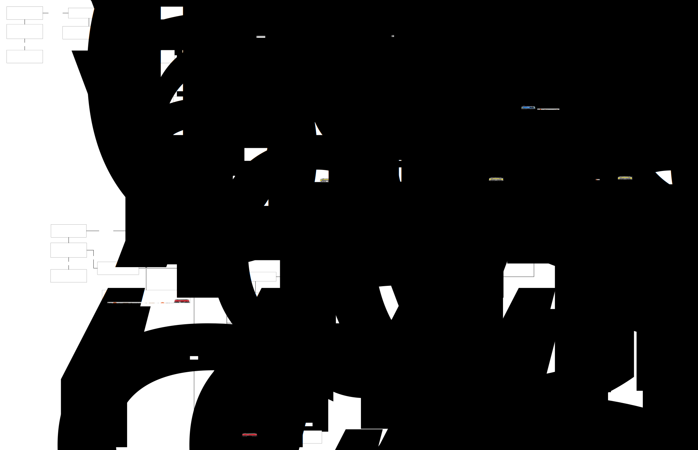

## Reizigerstrein met opstellen, vervoer en onderhoud

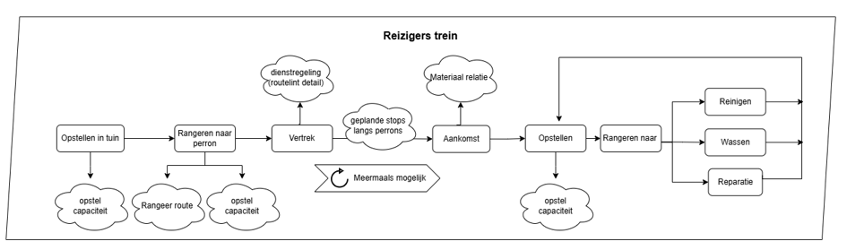Dit scenario beschrijft de volledige levenscyclus van een reizigerstrein vanaf het opstellen van materieel tot en met het uitvoeren van onderhoudsactiviteiten. Het materieel staat aanvankelijk opgesteld in een opstelgebied en wordt via een rangeerbeweging naar het perron gebracht. Vervolgens wordt een treinbeweging uitgevoerd waarbij reizigers worden vervoerd tussen vertrek en aankomst, eventueel met geplande tussenstops langs perrons. Na aankomst ontstaat een nieuwe materieelopstelling, van waaruit het materieel opnieuw kan worden gerangeerd voor operationele activiteiten zoals reinigen, wassen, repareren of opnieuw opstellen.

Het scenario laat zien hoe treinbewegingen, materieelopstellingen, materieelsamenstellingen, materieeluitwisselingen en activiteiten gezamenlijk de volledige logistieke levenscyclus van een trein beschrijven. Daarnaast illustreert het de afwisseling tussen het gebruik van infrastructuurcapaciteit voor rijden (treinbewegingen) en voor stilstaan (materieelopstellingen), waarbij het materieel gedurende zijn levenscyclus meerdere malen van functie en locatie kan veranderen.

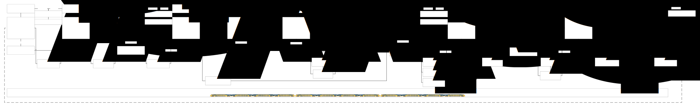
