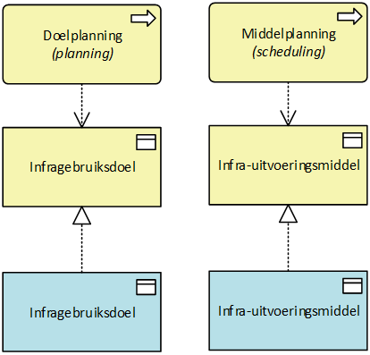
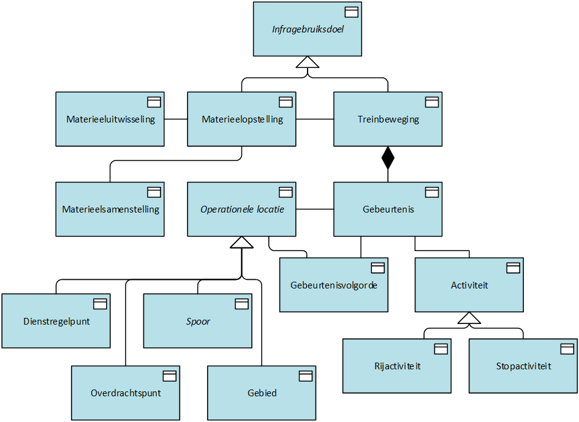

# Inleiding

Het Real Time Traffic Plan (RTTP) vormt de centrale planbasis voor het plannen, monitoren en bijsturen van het treinverkeer binnen ProRail Logistiek. Het RTTP ondersteunt het realiseren van één integraal, actueel en gedeeld verkeersproductieplan als basis voor een plangedreven besturing van het spoorverkeer.

Om deze gemeenschappelijke planbasis mogelijk te maken is een eenduidig informatiemodel noodzakelijk. Het Conceptueel Informatiemodel RTTP (CIM RTTP) beschrijft de belangrijkste concepten, attributen en relaties die nodig zijn om het geplande gebruik van infrastructuurcapaciteit vast te leggen. Het model vormt daarmee een gemeenschappelijke semantische basis voor domeinexperts, ontwerpers, solution architecten en ontwikkelaars.

Het CIM RTTP richt zich op de betekenis van informatie en niet op de wijze waarop deze informatie in systemen wordt opgeslagen of uitgewisseld. Het model beschrijft de kernconcepten rondom treinbewegingen, materieelopstellingen, gebeurtenissen, activiteiten, materieelsamenstellingen en materieeluitwisselingen, alsmede de onderlinge samenhang tussen deze concepten.

Het model is ontworpen volgens het principe van een stabiele conceptuele kern met gecontroleerde uitbreidbare detaillering. Hierdoor kunnen uiteenlopende operationele scenario's, zoals vervoeren, rangeren, overgaan, splitsen, combineren, keren en locomotief omlopen, op consistente wijze worden beschreven zonder dat voor iedere situatie afzonderlijke concepten nodig zijn.

Het CIM RTTP vormt daarmee het conceptuele fundament voor de verdere uitwerking van logische modellen, applicaties en gegevensuitwisselingen binnen het RTTP-domein en draagt bij aan één gedeeld begrip van de logistieke werkelijkheid binnen de spoorsector.

**Leeswijzer**

Dit document beschrijft het Conceptueel Informatiemodel Real Time Traffic Plan (CIM RTTP).

Het document is opgebouwd uit drie delen. Allereerst worden de **ontwerpprincipes** beschreven die als uitgangspunt hebben gediend voor de inrichting van het informatiemodel. Deze principes verklaren de belangrijkste architectuur- en modelleerkeuzes die tijdens de ontwikkeling van het model zijn gemaakt.

Vervolgens worden de **algemene principes** beschreven. Dit hoofdstuk geeft een nadere toelichting op de belangrijkste modelleerkeuzes en de wijze waarop de kernconcepten binnen het model zijn geïnterpreteerd. Onderwerpen zoals het onderscheid tussen treinbewegingen, materieelopstellingen, gebeurtenissen, activiteiten, materieelsamenstellingen en materieeluitwisselingen worden hier toegelicht.

Daarna volgt de **gegevensdefinitie van het CIM RTTP**. Dit deel bevat de formele beschrijving van alle objecttypen, attribuutsoorten, relaties, domeinwaarden en definities die onderdeel uitmaken van het conceptuele informatiemodel.

In de **Bijlage** is een korte leeswijzer opgenomen voor het interpreteren van UML-klassendiagrammen. Deze bijlage is bedoeld voor lezers die minder vertrouwd zijn met UML-notatie en beschrijft de betekenis van onder andere objecttypen, attributen, relaties, cardinaliteiten en overerving.

# Ontwerpprincipes

## Stabiele conceptuele kern als basis voor logische modellen

Het CIM RTTP is ontworpen volgens het principe van een stabiele conceptuele kern met gecontroleerde uitbreidbare detaillering. Het model beschrijft de voor het RTTP-domein gemeenschappelijke concepten, attributen, relaties en betekenissen. Daarmee vormt het een gedeeld semantisch referentiekader voor domeinexperts, architecten en ontwerpers en de basis voor verdere uitwerking in logische en technische modellen.

Bij het modelleren is bewust gekozen voor een beperkte set kernconcepten, zoals treinbeweging, gebeurtenis, activiteit, materieelopstelling en materieeluitwisseling. Deze concepten zijn voldoende generiek om uiteenlopende operationele scenario’s te beschrijven, terwijl de betekenis herkenbaar en begrijpelijk blijft. Hierdoor kan een groot aantal situaties worden gemodelleerd zonder voor iedere operationele variant nieuwe concepten te introduceren.

Het model is flexibel ingericht. Nieuwe scenario’s, zoals keren, locomotief omlopen, splitsen, combineren of toekomstige werkwijzen, worden zoveel mogelijk beschreven door bestaande concepten op een andere manier te combineren. Hierdoor blijft de hoofdstructuur van het model stabiel, terwijl tegelijkertijd ruimte bestaat voor nieuwe inzichten en veranderende informatiebehoeften.

Wanneer nieuwe informatiebehoeften leiden tot aanvullende gedeelde semantiek binnen het RTTP-domein, kan het model worden uitgebreid met nieuwe concepten, attribuutsoorten, relatietypen of domeinwaarden. Uitbreidingen vinden daarbij plaats rondom de bestaande kernstructuur en leiden bij voorkeur niet tot wijzigingen van de fundamentele concepten en relaties.

Het CIM RTTP richt zich op de gemeenschappelijke betekenis van informatie en niet op de wijze waarop informatie in systemen wordt opgeslagen, uitgewisseld of verwerkt. Oplossingsspecifieke, systeemafhankelijke of implementatiegerichte uitwerkingen behoren daarom niet tot het CIM, maar worden uitgewerkt in logische of technische modellen. Logische modellen kunnen daarbij aanvullende attributen, relaties, cardinaliteiten, afleidingsregels en andere detailleringen introduceren, terwijl de semantiek van de onderliggende concepten behouden blijft.

Hierdoor blijft het CIM RTTP enerzijds een stabiel en begrijpelijk semantisch fundament voor het domein en anderzijds voldoende flexibel om nieuwe gedeelde informatiebehoeften op te nemen zonder de hoofdstructuur van het model te wijzigen.

## Koppeling met TSI

Het informatiemodel RTTP is bewust losjes gekoppeld aan TSI. Dat betekent dat RTTP niet afhankelijk is van de interne structuur of het datamodel van TSI. Waar het logisch en zinvol is, sluit RTTP aan op bestaande TSI‑concepten, maar het behoudt altijd een eigen, autonoom informatiemodel.

De koppeling tussen RTTP en TSI gebeurt via zogenaamde traces: vastgelegde relaties die aangeven hoe concepten zich tot elkaar verhouden, zonder dat RTTP direct wordt opgebouwd als uitbreiding van TSI. RTTP neemt TSI‑definities dus niet letterlijk over en leunt er technisch ook niet op.

De reden hiervoor is dat TSI primair is bedoeld voor interoperabiliteit tussen infrabeheerder en vervoerder, met name voor de uitwisseling van trein- en padinformatie. De communicatie over Trein en Pad tussen vervoerder en inframanager loopt via CM (verdeelde capaciteit , waardoor er architectonisch een duidelijke scheiding bestaat. Daarnaast schrijft TSI niet voor hoe RTTP zijn interne gegevens moet modelleren.

Door deze losse koppeling blijft RTTP functioneel zelfstandig, makkelijker te beheren en beter bestand tegen wijzigingen in TSI. Concreet betekent dit dat RTTP zoveel mogelijk gebruikmaakt van TSI‑concepten waar die inhoudelijk passen, maar geen uitbreiding vormt op TSI. In plaats daarvan worden duidelijke sporen (traces) vastgelegd tussen RTTP‑concepten en bijbehorende TSI‑concepten, ook als die niet één-op-één overeenkomen. Waar nodig gebruikt RTTP eigen, gecontextualiseerde varianten van TSI‑begrippen die beter passen bij het interne datadomein.

## Betekenisvolle concepten als uitgangspunt

Het conceptuele informatiemodel van RTTP bevat uitsluitend echte, betekenisvolle concepten uit het treindomein. Het model beschrijft dus de werkelijkheid: dingen die in het domein daadwerkelijk bestaan en waarover domeinexperts ook zo praten, zoals een Treinbeweging, Materieelopstelling of Materieelsamenstelling.

Deze benadering sluit aan bij gangbare architectuurtheorie, zoals het begrip *Information Concept* binnen BIZBOK en het conceptuele niveau uit het [Metamodel voor Informatiemodellering](https://docs.geostandaarden.nl/mim/mim/), waarin betekenisvolle begrippen uit het domein centraal staan en los van implementatie worden gemodelleerd.

Technische hulpconstructies zoals relatie‑objecten, koppeltabellen of berichtspecifieke structuren horen hier niet thuis. Objecten als “BewegingRelatie” of “MaterieelRelatie” hebben geen zelfstandige betekenis in het domein en worden daarom niet opgenomen in het conceptuele model. Zulke constructies zijn pas relevant in het logisch of fysiek model, waar implementatiekeuzes worden vastgelegd.

Dit zorgt ervoor dat het conceptuele informatiemodel begrijpelijk blijft voor zowel domeinexperts als ontwerpers, en niet vervuilt met technische details. Het model blijft daarmee stabieler bij wijzigingen in systemen of interfaces en maakt duidelijk onderscheid tussen wat het domein is en hoe het technisch wordt geïmplementeerd. Alle technische complexiteit wordt bewust verplaatst naar de juiste modellagen.

## Semantisch correcte en eenduidige naamgeving

In het RTTP‑informatiemodel worden objecttypen en begrippen altijd benoemd op een manier die inhoudelijk klopt en aansluit bij hun betekenis in de werkelijkheid. Technisch gekleurde namen of legacy‑terminologie uit oudere systemen worden zoveel mogelijk vermeden.

De naam van een object beschrijft wat het object is, niet hoe het ooit technisch is gebruikt. Zo wordt iets dat in essentie een gebeurtenis is ook als zodanig benoemd, en geen “activiteit” genoemd. En een concept dat feitelijk een reservering van infrastructuur beschrijft, wordt niet aangeduid als een tijdslot als dat de lading niet dekt.

Deze semantische zuiverheid is belangrijk omdat het informatiemodel de gezamenlijke taal vormt voor domeinexperts, ontwerpers, ontwikkelaars en architecten. Namen die zijn ontstaan vanuit technische of historische keuzes zorgen vaak voor verwarring en interpretatieverschillen. Heldere en eenduidige begrippen leiden tot betere datakwaliteit, minder misverstanden en een duurzamer model.

In de praktijk betekent dit dat legacy termen alleen worden overgenomen als ze inhoudelijk correct zijn. Alle objectnamen worden getoetst op betekenis, domeinlogica en eenduidigheid. Implementaties mogen intern technische namen gebruiken, maar die hebben geen invloed op de conceptuele naamgeving.

## Onderscheid tussen plannen en uitvoeren: doel versus middel

In het RTTP‑informatiemodel wordt een duidelijk onderscheid gemaakt tussen wat men met de infrastructuur wil bereiken en hoe dat in de uitvoering wordt gerealiseerd.

Aan de ene kant zijn er infragebruiksdoelen. Dit zijn concepten die beschrijven waarvoor de infrastructuur wordt gebruikt en horen bij de planning. Voorbeelden zijn een Treinbeweging met als doel een treinrit, of een Materieelopstelling met als doel het parkeren van materieel.

Aan de andere kant zijn er infra-uitvoeringsmiddelen. Dit zijn concepten die beschrijven hoe de infrastructuur technisch of operationeel wordt ingezet om die doelen te realiseren. Deze horen bij de uitvoering. Voorbeelden hiervan zijn rijweginstructies, routes en toestemmingen voor het uitvoeren van bewegingen, zoals vrijgave van infrastructuur binnen een dienstregelpunt voor rangeren (oftewel Rangeertoestemming, ook wel VrijgaveRangeren genoemd) of het vrij bewegen door vervoerder in een gebied (oftewel Gebiedstoestemming, ook wel TijdRuimteSlot genoemd).

Een behulpzame vergelijking is die met een fabriek: het eindproduct is het gebruiksdoel, terwijl de lopende band en machines de productiemiddelen (oftewel uitvoeringsmiddelen) zijn waarmee het maken van het product wordt uitgevoerd. Door deze twee expliciet te scheiden, blijven procesdoelen en technische middelen uit elkaar, wordt het model begrijpelijker en neemt de herbruikbaarheid toe. Eén gebruiksdoel kan via meerdere middelen worden gerealiseerd, en een uitvoeringsmiddel kan meerdere doelen ondersteunen.

In het model worden objecten daarom expliciet ingedeeld als doel of als middel, en deze twee worden niet vermengd binnen één objecttype. Uitvoeringsmiddelen ondersteunen gebruiksdoelen via relaties, maar vervangen ze nooit. Nieuwe functionaliteit moet altijd eerst bepalen of er een nieuw doel of een nieuw middel wordt toegevoegd.

Deze scheiding sluit aan bij gangbare modellering uit ISA95, waar binnen de zogeheten Operations Definitions expliciet onderscheid wordt gemaakt tussen het *wat* (de beoogde operatie) en het *hoe* (de middelen waarmee deze wordt uitgevoerd), en de relatie tussen beide.

## Modellering conform het Metamodel voor Informatiemodellering (MIM)

Het Conceptueel Informatiemodel RTTP (CIM RTTP) is gemodelleerd conform het [**Metamodel voor Informatiemodellering (MIM)**](https://docs.geostandaarden.nl/mim/mim/) en uitgedrukt in **[Unified Modeling Language (UML](https://www.omg.org/UML/))**.

MIM is de Nederlandse standaard voor het eenduidig specificeren van informatiemodellen en biedt een gestandaardiseerde wijze om objecttypen, attributen, relaties, gegevensgroepen, referentielijsten en andere modelelementen te definiëren en te documenteren.

MIM beschrijft niet de inhoud van een informatiemodel, maar de regels en bouwstenen waarmee een informatiemodel wordt opgesteld. Het vormt daarmee een metamodel: een model waarmee informatiemodellen op een consistente en herleidbare wijze kunnen worden beschreven. Hierdoor ontstaat uniformiteit tussen informatiemodellen van verschillende organisaties en domeinen en wordt de uitwisselbaarheid en herbruikbaarheid van modellen vergroot.

Binnen RTTP is gekozen voor modellering op het niveau van een **Conceptueel Informatiemodel (CIM)**. Op dit niveau staan de betekenis van begrippen en de onderlinge samenhang centraal, onafhankelijk van technische implementaties, databasestructuren of uitwisselingsformaten. Het model beschrijft daarmee de semantiek van het RTTP-domein en vormt de basis voor verdere uitwerking naar logische en technische modellen.

Voor de weergave van het model wordt gebruikgemaakt van UML-klassendiagrammen. UML biedt een breed geaccepteerde en visueel toegankelijke notatie voor het beschrijven van informatiemodellen. In combinatie met MIM ontstaat een model dat zowel leesbaar is voor domeinexperts, ontwerpers en architecten als geschikt is voor geautomatiseerde verwerking.

De keuze voor MIM en UML biedt daarnaast de volgende voordelen:

- aansluiting op een binnen de Nederlandse overheid breed toegepaste modelleerstandaard;

- eenduidige beschrijving van semantiek, definities en relaties;

- visuele representatie van het model in UML-diagrammen;

- machineleesbare vastlegging van het model, bijvoorbeeld via XMI-export;

- ondersteuning van modelgedreven documentatiegeneratie;

- mogelijkheid tot generatie van afgeleide artefacten, zoals begrippenmodellen en implementatiemodellen;

- centrale vastlegging van de semantische kennis binnen één bronmodel.

Door toepassing van MIM wordt geborgd dat het informatiemodel RTTP op een consistente, herleidbare en toekomstvaste wijze is gemodelleerd en aansluit bij de binnen de Nederlandse digitale overheid gehanteerde methoden voor informatiemodellering.

# Algemene principes

Dit hoofdstuk beschrijft de belangrijkste modelleerkeuzes die zijn gemaakt bij de ontwikkeling van het CIM RTTP. Waar de ontwerpprincipes de uitgangspunten voor het ontwerp van het model beschrijven, geven de algemene principes nadere invulling aan de wijze waarop de kernconcepten binnen het model zijn afgebakend en geïnterpreteerd.

De beschreven principes lichten toe hoe concepten zoals treinbewegingen, materieelopstellingen, gebeurtenissen, activiteiten, locaties en tijdstippen in samenhang zijn gemodelleerd. Daarnaast maken zij inzichtelijk welke keuzes zijn gemaakt ten opzichte van bestaande modellen en terminologie en hoe deze bijdragen aan een semantisch zuiver, consistent en toekomstvast informatiemodel.

### Planning als uitgangspunt

Binnen RTTP wordt onderscheid gemaakt tussen twee vormen van planning:

1.  planning van gebruiksdoelen (oftewel *planning*): het plannen van treinbewegingen en materieelopstellingen;

2.  planning van uitvoeringsmiddelen (oftewel *scheduling*): het plannen van de inzet van middelen zoals rijweginstructies en toestemmingen.

Deze twee vormen van planning zijn nauw met elkaar verbonden: de planning van uitvoeringsmiddelen is afgeleid van en ondersteunend aan de planning van gebruiksdoelen, maar kent een eigen dynamiek en detaillering.

<figure>

<figcaption>
Planning en InfraGebruiksdoel vs. Scheduling en InfraUitvoeringsmiddel
</figcaption>
</figure>

Binnen RTTP geldt het principe dat alle gebruiksdoelen van infrastructuurcapaciteit zoals treinbewegingen en materieelopstellingen, wordt vastgelegd als een vorm van planning.

Ook als een gebruiksdoel pas kort voor uitvoering ontstaat, wordt dit niet gezien als “ongepland”, maar als een laat ontstane planning die onmiddellijk geldig is. Er is dus geen aparte categorie voor ongeplande gebruiksdoelen, gebeurtenissen en activiteiten.

Invloeden van buiten, zoals capaciteitsbeperkingen door storingen of onderhoud, maken geen onderdeel uit van de gebruiksdoelplanning zelf, maar beïnvloeden de beschikbare capaciteit en daarmee de realiseerbaarheid van de planning. Deze worden daarom binnen RTTP gerepresenteerd ten behoeve van analyse en bijsturing.

Dit zorgt voor een uniform en consistent datamodel voor planning van gebruiksdoelen: alles volgt dezelfde semantiek en dezelfde procesmatige benadering, ongeacht de tijdshorizon. Ook last‑minute beslissingen blijven hierdoor traceerbaar en te analyseren. Systemen hoeven geen uitzonderingen te ondersteunen buiten het planningsmodel om, wat de betrouwbaarheid vergroot.

Het onderscheid tussen planning en uitvoering is in RTTP daarom conceptueel, niet gebaseerd op tijd. Realisatie is altijd gekoppeld aan een gebruiksdoel, ook als dat pas op het moment van uitvoering wordt gevormd. Hierdoor is het model geschikt voor strategische, tactische, operationele én real‑time processen. De inzet van uitvoeringsmiddelen wordt hierbij afzonderlijk gepland in de middelplanning en is afgeleid van deze gebruiksdoelen.

## InfraGebruiksdoel

<figure>

<figcaption>
Overzicht informatieobjectenarchitectuur uitgedrukt als data-objecten in Archimate.
</figcaption>
</figure>

Het RTTP onderscheidt twee vormen van gepland gebruik (gebruiksdoel) van infrastructuurcapaciteit: **Treinbeweging** en **Materieelopstelling**.

Een **Treinbeweging** is het geplande gebruik van infrastructuurcapaciteit voor het uitvoeren van een treinrit. Hierbij verplaatst materieel zich over de spoorinfrastructuur, bijvoorbeeld voor het vervoeren van reizigers of goederen, het verplaatsen van leeg materieel of het uitvoeren van een rangeerbeweging.

Een **Materieelopstelling** is het geplande gebruik van infrastructuurcapaciteit door stilstaand materieel op een operationele locatie. Een materieelopstelling kan variëren van een zeer korte overgang tussen twee treinbewegingen tot langdurig parkeren of opstellen van materieel. Tijdens een materieelopstelling kunnen operationele activiteiten plaatsvinden, zoals splitsen, combineren, keren of locomotief omlopen.

### Treinbeweging

Elke Treinbeweging bestaat uit één of meer gebeurtenissen van het type ‘vertrek’, ‘aankomst’ of ‘doorkomst’. Een gebeurtenis representeert een betekenisvol moment op een operationele locatie en kan het uitvoeren van één of meer **activiteit**en initiëren. Elke treinbeweging begint en eindigt met een materieelopstelling.

De activiteiten zijn ontleend aan de mogelijke waarden van TrainActivityType in TSI.

In veel gevallen kan de volgorde van gebeurtenissen impliciet worden afgeleid uit de geplande tijdstippen en de volgorde binnen een treinbeweging. Voor gebeurtenissen op gedeelde infrastructuur, zoals doorkomsten of aankomsten op hetzelfde spoor, is deze volgorde echter niet altijd eenduidig af te leiden of moet deze expliciet worden vastgelegd voor sturing en bijsturing.

Hiervoor is het concept Gebeurtenisvolgorde toegevoegd. Dit legt de expliciete volgorde vast tussen twee gebeurtenissen (bron en doel) op een operationele locatie en representeert daarmee de ordening van gebruik van infrastructuurcapaciteit, onafhankelijk van de exacte tijdstippen.

### Gebeurtenissen en Activiteiten

#### Van Bewegingsactiviteit naar Gebeurtenis en Activiteit

In eerdere modellen werd het concept **Bewegingsactiviteit** gebruikt om aankomsten, vertrekken en doorkomsten binnen een treinbeweging vast te leggen. Hoewel deze benaming historisch ingeburgerd is, blijkt zij conceptueel minder zuiver te zijn. Een aankomst, vertrek of doorkomst is namelijk geen activiteit die gedurende een bepaalde tijd plaatsvindt, maar een gebeurtenis die op een specifiek moment plaatsvindt.

In het CIM RTTP is daarom onderscheid gemaakt tussen **Gebeurtenissen** en **Activiteiten**.

Een **Gebeurtenis** representeert een moment in de tijd waarop een relevante verandering plaatsvindt binnen een treinbeweging. Voorbeelden hiervan zijn een aankomst, vertrek of doorkomst. Gebeurtenissen leggen vast waar en wanneer iets plaatsvindt en vormen de grenspunten van activiteiten.

Een **Activiteit** representeert een handeling, gebruiksdoel of operationele situatie die gedurende een bepaalde periode plaatsvindt. Activiteiten hebben een begin- en eindpunt in de tijd en worden begrensd door gebeurtenissen.

Het onderscheid kan worden vergeleken met een reis:

- Vertrek is een gebeurtenis.

- Reizigers vervoeren is een bewegingsactiviteit.

- Aankomst is een gebeurtenis.

Gebeurtenissen hebben daarmee geen duur; activiteiten wel.

Door deze scheiding ontstaat een semantisch zuiver model waarin gebeurtenissen de begin- en eindpunten van activiteiten markeren. Een activiteit wordt daarom altijd begrensd door een begingebeurtenis en een eindgebeurtenis. Zo begint de bewegingsactiviteit *Reizigers vervoeren* bij een vertrekgebeurtenis en eindigt zij bij een aankomstgebeurtenis.

Ook wordt hiermee duidelijk waarom **Doorkomst** als gebeurtenis wordt gemodelleerd. Een doorkomst is een specifiek moment waarop een trein een locatie passeert en heeft geen eigen duur. Tussenliggende doorkomstgebeurtenissen fungeren als meet- en stuurmomenten binnen een bewegingsactiviteit, maar vormen zelf geen activiteit.

Door aankomst, vertrek en doorkomst niet langer als bewegingsactiviteiten maar als gebeurtenissen te modelleren, sluit het model beter aan op de werkelijkheid. Het onderscheid tussen gebeurtenissen (momenten) en activiteiten (tijdsintervallen) maakt de semantiek duidelijker en vormt een consistente basis voor verdere uitwerking in logische modellen en implementaties.

#### Gebeurtenissen, locaties en tijdstippen

Een treinbeweging bestaat uit één of meer gebeurtenissen van het type vertrek, doorkomst of aankomst. Een Gebeurtenis vindt plaats op een locatie, zijnde Operationel locatie. Een operationele locatie is een Dienstregelpunt, Gebied, Overdrachtspunt (*‘handover point’* of grenspunt) of specifiek Perron- of Opstelspoor.

Een gebeurtenis heeft één of meer tijdstippen, waarbij naast een tijdstip ook een tijdclassificatie wordt opgenomen[^1].

> In het conceptuele model worden tijdstippen gemodelleerd op basis van hun semantische betekenis, waarbij wordt aangesloten op de tijdstippen zoals gedefinieerd in TSI. De herkomst en toewijzing van deze tijdstippen, bijvoorbeeld vanuit systemen zoals CMS of pad- en treinplanningssystemen, maakt geen onderdeel uit van de conceptuele modellering en wordt in latere uitwerkingen bepaald.

| Vertrek | Aankomst | Doorkomst |
|----|----|----|
| publieke vertrektijd | publieke aankomsttijd |  |
| Vroegste vertrektijd | Vroegste aankomsttijd | Vroegste doorkomsttijd |
| Uiterste vertrektijd | Uiterste aankomsttijd | Uiterste doorkomsttijd |
| Werkelijke vertrektijd[^2] | Werkelijke aankomsttijd | Werkelijke doorkomsttijd |

> Werkelijke tijdstippen worden beschouwd als uitvoeringsinformatie en maken geen onderdeel uit van de planinformatie. De overige tijdstippen worden gebruikt voor planning en bijsturing. De wijze waarop tijdstippen worden toegepast of gepresenteerd aan gebruikers valt buiten de scope van dit conceptuele model. De precieze typering en indeling van tijdstippen vraagt nog nadere uitwerking.

De werkelijke vertrek-, aankomst- of doorkomsttijd is bij het plannen niet bekend, en wordt na/tijdens de uitvoering toegevoegd. De overige tijdstippen zijn onderdeel van het plannen van de treinbeweging, inclusief realtime bijsturing.

#### Activiteiten

Activiteiten representeren werkzaamheden, gebruiksdoelen of operationele handelingen die gedurende een bepaalde tijd plaatsvinden binnen een treinbeweging. In het model worden activiteiten begrensd door gebeurtenissen: een activiteit begint bij een begingebeurtenis en eindigt bij een eindgebeurtenis. Gebeurtenissen representeren daarmee momenten in de tijd, terwijl activiteiten tijdsintervallen representeren.

Binnen het model wordt onderscheid gemaakt tussen **Rijactiviteiten** en **Stopactiviteiten**.

Een **Rijactiviteit** beschrijft hoe een treinbeweging wordt uitgevoerd gedurende een bepaald deel van de rit. Een rijactiviteit wordt gekenmerkt door het gebruik van infrastructuurcapaciteit en kan worden beschreven met rijkarakteristieken en andere kenmerken die specifiek zijn voor dat deel van de treinbeweging. Binnen één treinbeweging kunnen meerdere rijactiviteiten voorkomen.

Een **Stopactiviteit** beschrijft activiteiten die plaatsvinden terwijl een trein tijdelijk niet rijdt. Stopactiviteiten maken geen gebruik van infrastructuurcapaciteit voor verplaatsing, maar beschrijven operationele handelingen of situaties die binnen een treinbeweging voorkomen, zoals laden, lossen, wachten, rangeren, tanken of het wisselen van machinist.

Meerdere activiteiten kunnen dezelfde begin- en eindgebeurtenis delen. Activiteiten worden als zelfstandige objecten gemodelleerd en kunnen, indien nodig, beschikken over aanvullende tijdstippen waarmee een eigen deelinterval binnen een groter tijdsinterval wordt vastgelegd.

Doorkomstgebeurtenissen vormen hierop een uitzondering. Een doorkomstgebeurtenis dient uitsluitend als meet- of stuurmoment voor planning, monitoring en bijsturing en begrenst op zichzelf geen activiteiten. Tussenliggende doorkomstgebeurtenissen hebben daarom geen invloed op de duur van activiteiten.

### Materieelopstelling, -samenstelling, en -uitwisseling

#### Van Materieelrelatie naar Materieelopstelling, Materieelsamenstelling en Materieeluitwisseling

In eerdere modellen werd de relatie tussen opeenvolgende treinbewegingen vastgelegd met het concept **Materieelrelatie** (ook wel *BewegingMaterieelrelatie* genoemd). Deze relatie beschreef dat treinbewegingen materieel met elkaar deelden en legde daarbij vast of sprake was van **overgaan**, **splitsen** of **combineren**.

Hoewel deze aanpak functioneel was, combineerde zij verschillende domeinconcepten in één object. De Materieelrelatie beschreef tegelijkertijd:

- de samenhang tussen treinbewegingen;

- de stroom van materieel tussen treinbewegingen;

- wijzigingen in de materieelsamenstelling;

- en impliciet de situatie waarin het materieel tussen twee treinbewegingen gebruik maakte van infrastructuurcapaciteit.

In het CIM RTTP zijn deze begrippen daarom expliciet van elkaar gescheiden.

De voormalige Materieelrelatie is opgesplitst in de concepten **Materieelopstelling, Materieelsamenstelling** en **Materieeluitwisseling**.

Een **Materieelopstelling** beschrijft de operationele situatie waarin materieel gedurende enige tijd op een operationele locatie is opgesteld en gebruik maakt van infrastructuurcapaciteit. Dit kan variëren van een zeer korte overgang tussen twee treinbewegingen tot langdurig parkeren of opstellen.

Een **Materieeluitwisseling** beschrijft vervolgens wat er met het materieel gebeurt tussen materieelopstellingen. Hierbij worden de verschillende vormen van materieelovergang expliciet vastgelegd, zoals:

- Overgaan;

- Splitsen;

- Combineren;

- Keren.

Daarnaast is de **Materieelsamenstelling** gekoppeld aan de Materieelopstelling, waardoor expliciet wordt vastgelegd welk materieel aanwezig is op een bepaalde locatie en op een bepaald moment.

Door deze opsplitsing wordt het model semantisch zuiverder:

- **Treinbewegingen** beschrijven het rijden;

- **Materieelopstellingen** beschrijven het gebruik van infrastructuurcapaciteit door stilstaand materieel;

- **Materieeluitwisselingen** beschrijven de veranderingen in de inzet van materieel;

- **Materieelsamenstellingen** beschrijven welk materieel aanwezig is.

Hierdoor wordt duidelijk onderscheid gemaakt tussen:

- de treinbeweging die het materieel verplaatst;

- de materieelopstelling waarin materieel gebruik maakt van infrastructuurcapaciteit;

- de materieelsamenstelling die beschrijft welk materieel aanwezig is;

- de materieeluitwisseling die beschrijft hoe de samenstelling wijzigt.

Hierdoor blijven infrastructuurgebruik, materieelstromen en materieelsamenstellingen afzonderlijk, maar in samenhang gemodelleerd. De samenhang tussen opeenvolgende treinbewegingen blijft daarbij behouden. Het model sluit daarmee beter aan op de werkelijkheid en biedt meer flexibiliteit voor het modelleren van uiteenlopende operationele scenario's zoals overgaan, splitsen, combineren, keren en locomotief omlopen.

#### Materieelopstelling

Een materieelopstelling begint met het einde van een aanvoerende treinbeweging en eindigt met het begin van een afvoerende treinbeweging.

Elke treinbeweging begint vanuit een materieelopstelling, hoe kort deze ook duurt, op de betreffende operationele locatie. Een dergelijke materieelopstelling kan in sommige gevallen impliciet of van zeer korte duur zijn.

Daarmee vormt een materieelopstelling de overgang tussen twee treinbewegingen.

Informatiekundig wordt dit vastgelegd door de relaties dat een materieelopstelling **ontstaat uit** het einde van een treinbeweging en **eindigt door** het begin van een treinbeweging. Bijvoorbeeld: een treinbeweging in de vorm van een rangeerbeweging eindigt met een aankomst op een opstelspoor. Op dat moment start de materieelopstelling. De materieelopstelling eindigt vervolgens met het vertrek van een volgende treinbeweging.

Elke materieelopstelling heeft daarbij steeds precies:

- één aanvoerende treinbeweging, en

- één afvoerende treinbeweging.

Een materieelopstelling representeert het gebruik van infrastructuurcapaciteit door materieel op een operationele locatie. Dit gebruik kan variëren van een zeer korte overgang tussen twee treinbewegingen tot langdurig parkeren of opstellen.

#### Materieelsamenstelling

Een materieelsamenstelling beschrijft welk materieel op een bepaald moment gezamenlijk als één operationele eenheid is samengesteld.

In het CIM RTTP is een materieelsamenstelling gekoppeld aan een materieelopstelling en niet rechtstreeks aan een treinbeweging. De reden hiervoor is dat wijzigingen in de materieelsamenstelling uitsluitend kunnen plaatsvinden tijdens een materieelopstelling en niet tijdens een treinbeweging.

Tijdens een treinbeweging wordt de materieelsamenstelling beschouwd als gegeven. Wijzigingen in de samenstelling kunnen uitsluitend plaatsvinden tijdens een materieelopstelling en worden vastgelegd via materieeluitwisselingen.

Doordat elke materieelopstelling precies één aanvoerende en één afvoerende treinbeweging heeft, is eenvoudig af te leiden met welke materieelsamenstelling een treinbeweging wordt uitgevoerd. Een afzonderlijke directe relatie tussen treinbeweging en materieelsamenstelling is daarom niet noodzakelijk.

Door de materieelsamenstelling aan de materieelopstelling te koppelen kunnen wijzigingen in de samenstelling expliciet worden vastgelegd via materieeluitwisselingen, zoals overgaan, splitsen, combineren en keren. Hierdoor wordt duidelijk onderscheid gemaakt tussen:

- de treinbeweging die het materieel verplaatst;

- de materieelopstelling waarin het materieel zich bevindt;

- de materieelsamenstelling van dat materieel;

- en de materieeluitwisseling waarmee wijzigingen in de samenstelling worden vastgelegd.

Deze modellering sluit aan bij de operationele werkelijkheid: een trein kan rijden met een bepaalde samenstelling, maar een wijziging van die samenstelling vindt plaats tijdens een stop, opstelling of andere operationele situatie tussen twee treinbewegingen. Hierdoor blijven materieelstromen, samenstellingen en treinbewegingen afzonderlijk maar samenhangend gemodelleerd.

#### Materieeluitwisseling

Tijdens een materieelopstelling kan materieel worden uitgewisseld tussen aanvoerende en afvoerende treinbewegingen. Deze uitwisselingen worden gemodelleerd met de relatieklasse Materieeluitwisseling, die relaties legt tussen bron- en doelopstellingen.

De materieeluitwisselingen kunnen de volgende vormen aannemen:

- *Overgaan:* De materieelsamenstelling blijft ongewijzigd. Het materieel gaat over van de ene treinbeweging naar de andere binnen dezelfde materieelopstelling . De bron- en doelopstelling zijn hierbij identiek.

- *Splitsen:* De materieelsamenstelling wijzigt door het opsplitsen van materieel in één of meer delen. Materieel gaat over van één bronopstelling naar twee of meer doelopstellingen, die behoren bij de afvoerende treinbewegingen.

- *Combineren:* De materieelsamenstelling wijzigt door het combineren van materieel uit twee of meer bronopstellingen tot één nieuwe samenstelling. Materieel gaat over van twee of meer bronopstellingen naar één doelopstelling, die behoren bij de afvoerende treinbeweging.

De relatie tussen bron- en doelopstellingen wordt expliciet vastgelegd met de relatieklasse *Materieeluitwisseling* (voorheen: Materieelrelatie).

## Tijdlijn geldigheid en tijdlijn registratie

Binnen IMRTTP kunnen gegevens worden voorzien van een **tijdlijn geldigheid** (materiële historie) en een **tijdlijn registratie** (formele historie). Hiermee kan zowel de ontwikkeling van de werkelijkheid als de ontwikkeling van de registratie worden gereconstrueerd.

### Tijdlijn geldigheid (materiële historie)

De tijdlijn geldigheid legt vast **gedurende welke periode een waarde in de werkelijkheid geldig is of was**. Hiermee wordt beschreven hoe de feitelijke situatie zich in de tijd ontwikkelt.

Voorbeeld:

- Een bewegingsactiviteit wordt aanvankelijk uitgevoerd als stoptrein.

- Vanaf een bepaald moment wordt deze uitgevoerd als intercity.

De tijdlijn geldigheid maakt inzichtelijk vanaf welk moment de waarde *stoptrein* respectievelijk *intercity* van toepassing is geweest.

Materiële historie wordt toegepast op gegevens waarvan de waarde in de werkelijkheid kan wijzigen en waarvan het relevant is deze wijzigingen in de tijd te kunnen reconstrueren.

### Tijdlijn registratie (formele historie)

De tijdlijn registratie legt vast **wanneer een waarde in de administratie is vastgelegd, gewijzigd of vervallen**. Hiermee wordt inzichtelijk welke informatie op een bepaald registratiemoment bekend was.

Voorbeeld:

- Op 10:00 uur wordt een verwachte aankomsttijd van 10:15 geregistreerd.

- Om 10:05 uur wordt deze verwachting aangepast naar 10:20.

- Om 10:10 uur wordt een nieuwe verwachting van 10:25 geregistreerd.

De tijdlijn registratie maakt inzichtelijk welke waarde op elk registratiemoment bekend was, ongeacht wanneer deze in de werkelijkheid geldig was.

### Samenhang

Materiële en formele historie vullen elkaar aan:

- De **tijdlijn geldigheid** beantwoordt de vraag: *"Wanneer gold deze waarde in de werkelijkheid?"*

- De **tijdlijn registratie** beantwoordt de vraag: *"Wanneer was deze waarde bij het systeem of de organisatie bekend?"*

Hierdoor kan zowel de historische werkelijkheid als de historische kennis over die werkelijkheid worden gereconstrueerd.

### Toepassing

Objecttypen en attributen die een veranderlijke eigenschap van de operationele werkelijkheid beschrijven, kunnen zowel materiële als formele historie opbouwen. Voorbeelden zijn treinsoort, tijdstip op locatie, route, gebied en status. Identificerende gegevens bouwen in het algemeen geen materiële historie op, omdat hun waarde gedurende de levensduur van het object niet wijzigt.

## Metagegeven: Mogelijk geen waarde

Het metagegeven **Mogelijk geen waarde** geeft aan dat voor een attribuut of relatie geen waarde hoeft te zijn geregistreerd, omdat onbekend is of er daadwerkelijk een waarde bestaat of omdat de waarde niet kan worden vastgesteld. Het betreft daarmee geen afwezigheid van een waarde, maar een toegestane onzekerheid over het bestaan of de inhoud van de waarde.

Dit metagegeven maakt het mogelijk om gegevens op te nemen waarvan bekend is dat zij in beginsel een waarde kunnen of behoren te hebben, terwijl deze waarde op het moment van registratie niet beschikbaar is. Het ontbreken van een waarde hoeft in die gevallen niet te betekenen dat de waarde niet bestaat.

**Voorbeelden**

- Het **land van herkomst** van een persoon is onbekend. Hoewel ieder persoon een land van herkomst heeft, kan het voorkomen dat deze informatie niet kan worden vastgesteld.

- Het **RSIN** van een organisatie ontbreekt in historische gegevens die zijn geregistreerd voordat het RSIN werd ingevoerd. Het gegeven behoort tot het actuele informatiemodel, maar de waarde kan voor oudere registraties onbekend zijn.

- Voor een **tijdstip op locatie** is bekend dat een gebeurtenis heeft plaatsgevonden, maar het exacte tijdstip kon niet worden vastgesteld.

### Relatie met kardinaliteit

Het metagegeven *Mogelijk geen waarde* verschilt van de kardinaliteit van een attribuut of relatie.

- Een kardinaliteit van **0..1** betekent dat een waarde niet altijd hoeft voor te komen.

- Het metagegeven **Mogelijk geen waarde** betekent dat een waarde conceptueel wel kan of moet bestaan, maar dat deze onbekend mag zijn.

Het ontbreken van een waarde heeft in dat geval dus een andere betekenis dan "niet van toepassing".

### Toepassing

Het metagegeven wordt toegepast op:

- **Attribuutsoorten**

- **Relatiesoorten**

waarvoor het toegestaan is dat de aanwezigheid of inhoud van een waarde onbekend blijft, eventueel onder nader vastgelegde voorwaarden of met vermelding van een reden voor het ontbreken van de waarde.

### Samenhang met historie

Wanneer een attribuut materiële of formele historie opbouwt, kan het voorkomen dat gedurende een bepaalde periode geen waarde bekend is. Het metagegeven *Mogelijk geen waarde* maakt expliciet dat deze onbekendheid onderdeel is van de geregistreerde werkelijkheid en niet hoeft te worden beschouwd als een fout in de registratie. Hierdoor blijft onderscheid mogelijk tussen:

- een bekende waarde;

- een niet van toepassing zijnde waarde;

- een onbekende waarde waarvoor het toegestaan is dat deze ontbreekt.

## Verwerking van TSI-activiteiten

De activiteiten zoals onderscheiden binnen TSI zijn binnen IMRTTP niet als één generieke activiteitenclassificatie gemodelleerd. In plaats daarvan zijn deze ondergebracht bij de objecttypen waarop zij inhoudelijk betrekking hebben. Hiermee sluit de classificatie van activiteiten aan op de semantiek van het object dat wordt beschreven.

IMRTTP onderscheidt daarbij bewegingsactiviteiten, werkactiviteiten, materieeluitwisselingen en materieelopstellingen. Voor elk van deze objecttypen is een eigen referentielijst opgenomen die de voor dat objecttype relevante activiteitsoorten bevat:

- **SoortBewegingsactiviteit** voor bewegingsactiviteiten;

- **SoortWerkactiviteit** voor werkactiviteiten;

- **Uitwisselingshandeling** voor materieeluitwisselingen;

- **TypeOpstelling** voor materieelopstellingen.

Door deze indeling worden activiteiten vastgelegd in de context waarin zij operationeel betekenis hebben. Activiteiten die betrekking hebben op het verplaatsen van treinmaterieel worden gemodelleerd als bewegingsactiviteiten, activiteiten die gedurende een treinbeweging worden uitgevoerd zonder dat sprake is van een verplaatsing als werkactiviteiten, handelingen waarbij materieel overgaat van de ene treinbeweging naar een andere als materieeluitwisselingen en vormen van stilstaand materieel als materieelopstellingen.

Deze aanpak zorgt ervoor dat de classificatie van activiteiten aansluit op de structuur van IMRTTP en voorkomt dat één generieke activiteitenlijst moet worden toegepast op objecttypen waarvoor een deel van de waarden geen betekenis heeft. De herkomst van de classificaties blijft daarbij herleidbaar naar de overeenkomstige TSI-activiteiten.

## Datakwaliteit

### Volledigheid

Alles in RTTP wordt gepland. In de tijd kan het voorkomen dat bepaalde gegevens nog niet kunnen worden ingevuld, bijvoorbeeld exacte Materieelopstelling en Treinbewegingen bij een VolumeInfraInzet, Of Afvoerende Treinbewegingen zijn nog niet bekend bij Materieelopstellingen.

### Positionele nauwkeurigheid

Afhankelijk van nauwkeurigheid van de posities van Operationele Locaties, Infra, assets etc. zoals bijgehouden door AM, en de daar van afgeleide gegevens door Logistiek t.b.v. planning en scheduling.

### Consistentie

In onderstaande tabel is per activiteitstype aangegeven welke typen begin- en eindgebeurtenissen logisch zijn. Deze tabel dient als richtlijn voor het consistent vullen van het model en heeft geen invloed op de structurele relaties in het conceptuele model.

| Activiteit          | Begingebeurtenis | Eindgebeurtenis |
|---------------------|------------------|-----------------|
| Commercieel stoppen | Aankomst         | Vertrek         |
| Machinist wisselen  | Aankomst         | Vertrek         |
| Alleen uitstappen   | Aankomst         | Vertrek         |
| Kopmaken            | Aankomst         | Vertrek         |
| Parkeren            | Aankomst         | Vertrek         |
| Rangeren            | Vertrek          | Aankomst        |
| Locomotief omlopen  | Vertrek          | Aankomst        |

[^1]: In het conceptuele model worden tijdstippen gemodelleerd op basis van hun semantische betekenis, waarbij wordt aangesloten op de tijdstippen zoals gedefinieerd in TSI. De herkomst en toewijzing van deze tijdstippen, bijvoorbeeld vanuit systemen zoals CMS of pad- en treinplanningssystemen, maakt geen onderdeel uit van de conceptuele modellering en wordt in latere uitwerkingen bepaald.

[^2]: Werkelijke tijdstippen worden beschouwd als uitvoeringsinformatie en maken geen onderdeel uit van de planinformatie. De overige tijdstippen worden gebruikt voor planning en bijsturing. De wijze waarop tijdstippen worden toegepast of gepresenteerd aan gebruikers valt buiten de scope van dit conceptuele model. De precieze typering en indeling van tijdstippen vraagt nog nadere uitwerking.
